# Standard Operating Procedures

## ACCOUNTING

### Purpose

This SOP outlines the process for recording, updating, and managing transactions in the Excel sheet to ensure accuracy and consistency.

### Scope

This SOP applies to all personnel responsible for managing financial transactions in the company's Excel sheet.

### Responsibilities

This SOP must be followed by all accountants, financial analysts, and any staff members involved in transaction management.

### Definitions

- **Transaction**: It is a Financial Operation which Involves the exchange of funds.
- **Ledger**: A Spreadsheet used to record all the financial transactions.

---

## How to Create a Transaction in E and I Tracker Sheet

1. First, identify the expense or income by reviewing the bank statement.
2. Analyze which sheet the transaction should be updated in and record it there. Below are the primary sheets:

   - **Freedom Blast**: This is the Futuristic Transactions sheet containing all expense and income data up to December. It provides a complete projection view for smooth business operations.
   - **Transaction Past**: This is the core sheet where all expenses and income that have already been transacted are recorded. Expenses are logged based on bills and invoices, while income is based on received funds. This sheet includes department and category data for easy reference.
   - **Account Details**: This sheet shows current balances daily for analysis and decision-making. It includes loans received from hand and secured sources, such as banks and financial applications. Components like interest percentage, tenure, and principal balances are also included for fund analysis.

---

## Creation of a Transaction related to Salary Paid

1. **Step 1**: Open the **Kaas App** from the desktop via shortcut.

   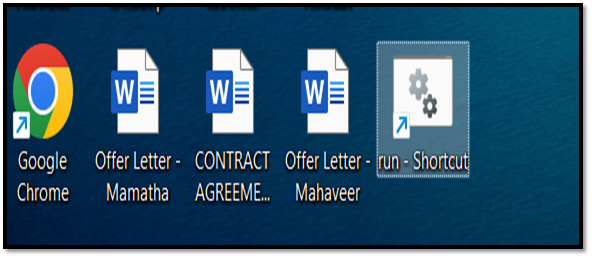

   
Kaas App Icon

2. **Step 2**: Go to the **Freedom (Future)** sheet in the app and process the transaction for which the credit is raised.

   - **Example Transaction**: Forecasted transaction to be processed from Freedom Sheet.

   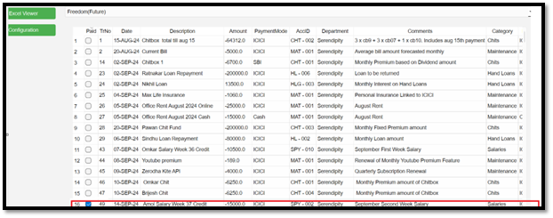

   
Freedom(Future) Sheet

   - Once the transaction is selected, click on the **Process Transactions** tab to clear it from the sheet.

   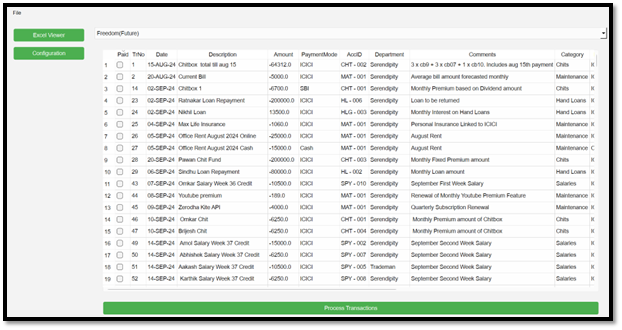

   
Freedom(Future) Sheet

3. After processing, the transaction will be updated in:

   - **Transactions (Past)** sheet
   - **Category (Salaries)**
   - **Account Details**

   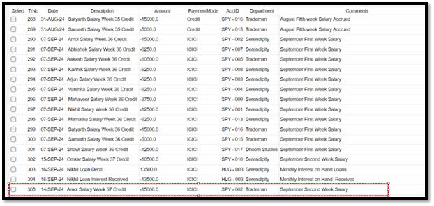

   
Transactions Past

   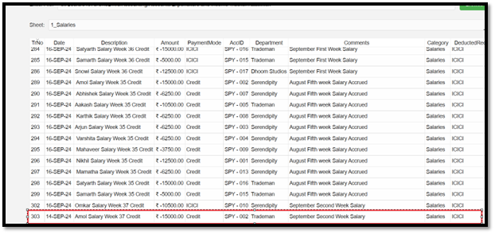

   
Salaries

   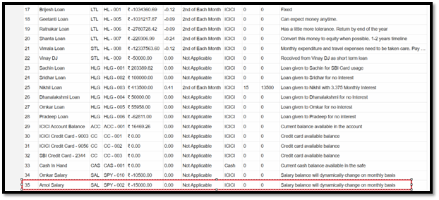
   
Account Details

4. **Main Dashboard** – Check the **Current Total Projected Expenses** section for updates.

   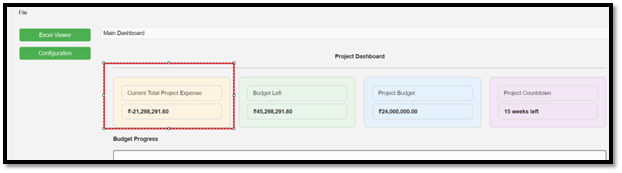

---

## Creation of New Transactions if No Transaction Exists in Freedom Sheet

1. **Step 1** – Go to the **Kaas App** and enter the expense or income in the **Transactions Past** sheet by clicking on the **Add Transaction** button.

   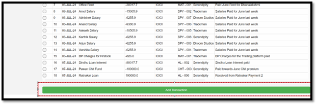

   
Creation of new Transactions without forecasting

2. Enter the relevant details in the rows and click **OK**.

   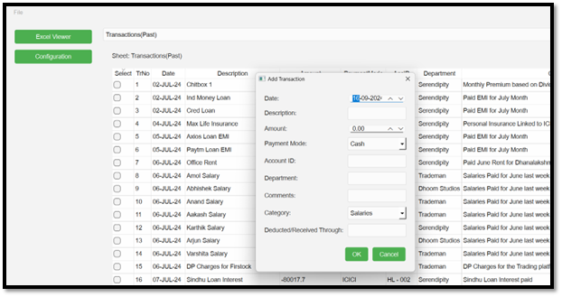

### Column Index for Transactions

- **TrNo** – Transaction Number
- **Date** – The date when the expense or income is recorded
- **Description** – Particulars of the transaction
- **Amount** – Negative for expenses, positive for income, in rupees
- **PaymentMode** – Mode of transaction (e.g., bank, cash, credit card)
- **AccID** – ID for identifying payment types, useful for accounts with similar payments
- **Department** – Departments include Serendipity, Trademan, and Dhoom Studios
- **Comments** – Detailed transaction explanation
- **Category** – Categories include Salaries, Maintenance, Income, EMI, Hand Loans, and Chits
- **Deductedthrough** – Secondary check for fund deduction sources, e.g., auto debits
- **ZohoMatch** – Indicator to match transactions recorded in Zoho accounting software

---

## Categorization in Zoho

Once feeds are generated from Zoho, they should be recorded in the **Transaction Past** sheet and categorized. Then, categorize transactions in Zoho with descriptions.

1. **First Step**: Record transactions in the Transaction Past sheet with all relevant data.

   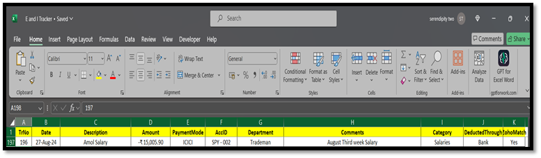

2. **Relevant Category Sheet**: Categorize transactions based on their category.

   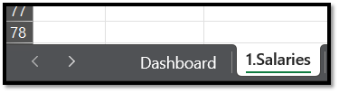

   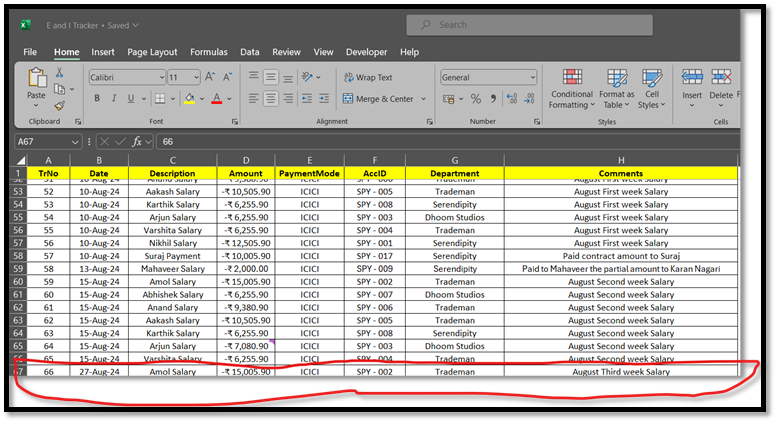

   
similarly for a transaction recorded and categorized as Maintenance.

   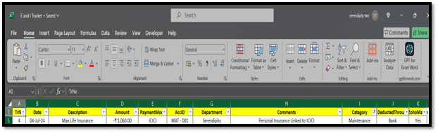

   
Maintenance Category Sheet

   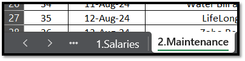
   
   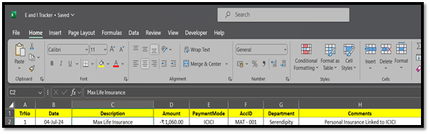

   
Similarly for a transaction recorded and categorized as Income.

   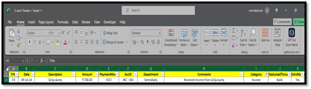

   
Income Category Sheet

   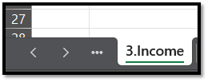

   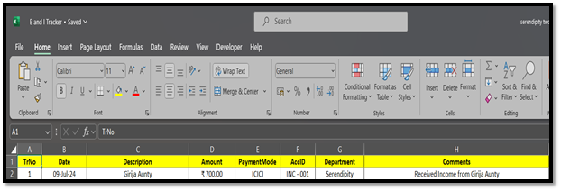

### Category Wise Description

- **Salaries** – Weekly payouts by Serendipity to employees.
- **Maintenance** – Expenses related to utilities, rent, phone bills, and other office needs.
- **Income** – Income generated from contracts, theatre rent, and service fees.
- **EMI** – EMI payments owed to banks at agreed interest rates.
- **Hand Loans** – Loans from family and friends with agreed interest and payable terms.
- **Chits** – Monthly premium and refund-related chit payments.

---

## How to Enter a New Description in Account Details Sheet

When a new account is created for hand loans or EMI loans:

1. Create a new account in **Hand Loans** or **EMI** sections.
2. Enter all columns with relevant details like TrNo and Account Name.
3. Update the current principal from the EMI reconciliation sheet and hand loan closing balance.

   - **Hand Loans and EMI Sheet**: This sheet will show the total paid amount, updated after the 5th of each month, providing a clear view of the current principal owed to creditors.

   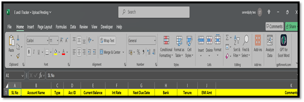

---
