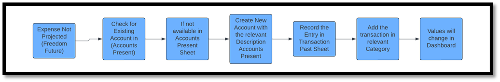
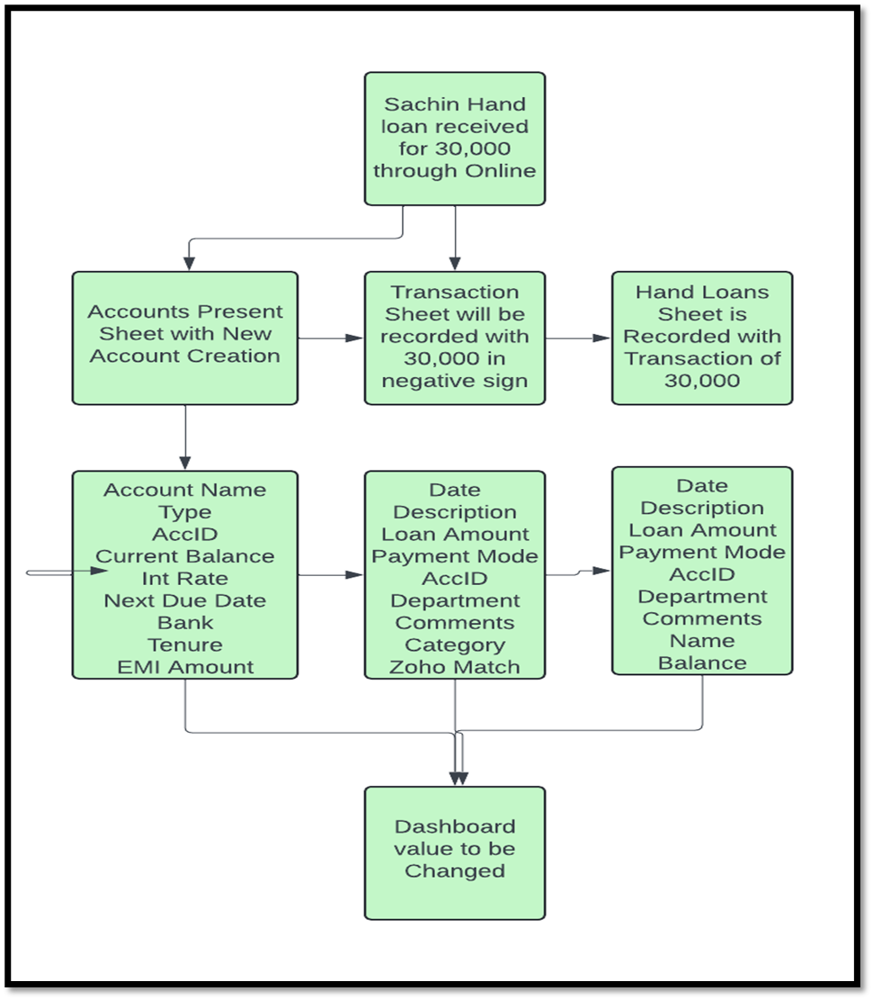
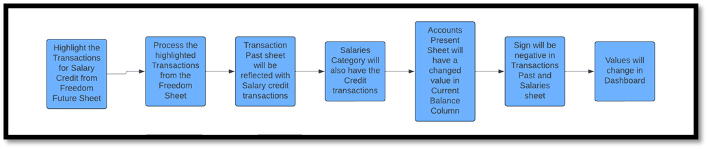
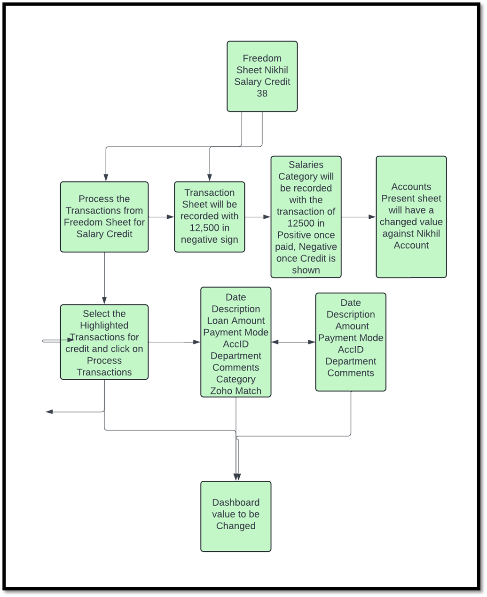
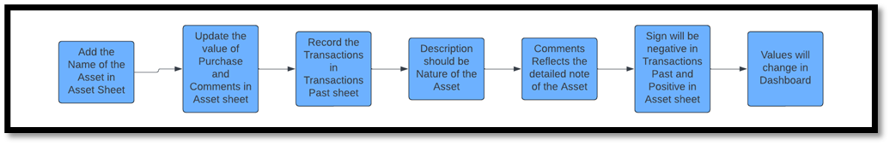
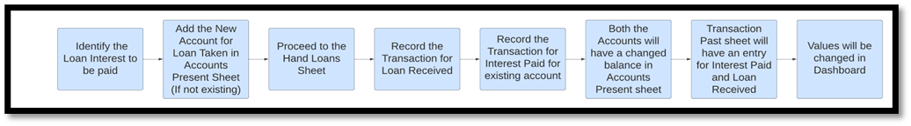

<!-- # Transaction Scenarios

This document provides guidance on handling various transaction scenarios within the system, including categorization, signs, and necessary entries.

---

## **Scenario 1: Handling an Expense Not Available in Freedom (Future) Sheet**

**Question**: How should we treat an expense that is not projected in the Freedom (Future) sheet?

**Answer**:  
When an expense is not listed in Freedom (Future), follow these steps:

1. **Create a New Account**:  
   Add a new account in the Accounts (Present) sheet with the relevant details.

2. **Add the Expense to Transaction (Past)**:  
   Record the expense in the Transaction (Past) sheet.

3. **Categorize the Expense**:  
   Assign the expense to an appropriate category. For instance, if it's a one-time expense like a new hand loan from Sachin, add the details under the "Hand Loans" category.

4. **Dashboard Update**:  
   Update the "Total Projected Expenses" tab in the main dashboard.

**Example**:  
*Hand Loan received from Sachin for ₹30,000*. If no loan account exists for Sachin, create a new loan account and represent it as shown below:

> 

---

## **Scenario 2: Highlighting Salary Credit and Salary Payment**

**Question**: How do we highlight salary credits and payments in the Freedom sheet and Transaction (Past) sheet? What signs should we use?

**Answer**:  
Since salaries are paid weekly:

1. **Future Projections**:  
   Add the expected salary credit date in Freedom (Future) as per the weekend date.

2. **Transaction Processing**:  
   Once processed, update the Transaction (Past) sheet with a negative sign for "Salary Credit" and add it to the "Salaries" category.

3. **Recording Salary Payment**:  
   Record the actual salary payment in the Transaction (Past) and "Salaries" category as a positive sign. In Transaction (Past), use a negative sign.

**Example**:  
*Nikhil Salary Credit for week 38 due on Sep 28*  
The process and representation are as follows:

> 

---

## **Scenario 3: Showing Assets in Transaction (Past)**

**Question**: How can assets be represented in the Transaction (Past) sheet, including description and comments?

**Answer**:  
Assets are handled differently:

1. **Record in Transaction (Past)**:  
   Record the expense as a negative amount in the Transaction (Past) sheet.

2. **Update Dashboard**:  
   Reflect the asset in the main dashboard, even though its yield value cannot be calculated.

3. **Description and Comments**:  
   - **Description**: Enter the name of the asset.
   - **Comments**: Provide a detailed description, including the nature of the asset.

---

## **Scenario 4: Interest Paid for an Existing Loan with a New Hand Loan**

**Question**: How do we handle interest paid on an existing loan by taking a new hand loan?

**Answer**:  
For situations where an existing loan’s monthly interest is paid using a new hand loan:

1. **Transaction Entry**:  
   Record a transaction against the existing hand loan holder for the interest paid.

2. **New Account**:  
   If the new hand loan account does not exist, create it in the Accounts (Present) sheet.

3. **Record in Hand Loans Sheet**:  
   Add a transaction for the amount received in the Hand Loans sheet.

4. **Update Balances**:  
   Ensure the balance in Accounts (Present) reflects both payable and receivable entries.

---

## **Scenario 5: Hand Loan Received with Partial Bank Deposit and Maintenance**

**Question**: How do we split a transaction where ₹50,000 cash is received as a hand loan, but only ₹49,000 is deposited in the bank, with the remaining ₹1,000 used for maintenance?

**Answer**:

1. **New Account**:  
   If no account exists for this loan, create it in Accounts (Present).

2. **Transaction Entry in Transaction (Past)**:  
   - **Hand Loan Account**: Record ₹50,000 as a positive amount.
   - **Cash Account (Safe)**: Credit ₹50,000 as a negative amount.

3. **Bank Deposit and Maintenance Expense**:  
   - **Bank Deposit**: Record ₹49,000 with the description “Deposit to bank account.”
   - **Maintenance Expense**: Record ₹1,000 in the Maintenance category, with a negative sign.

4. **Hand Loans Sheet**:  
   Reflect ₹50,000 for the hand loan, with corresponding entries of ₹49,000 and ₹1,000 in Transaction (Past).

> 

---

Each of these scenarios ensures accurate categorization and clarity in financial transactions for future reference and auditing. -->

# Transaction Scenarios

### How to treat an expense which is not available in Freedom Future sheet?

**Answer:** When an expense is not projected in Freedom (Future), we need to:
1. Add a new account in the **Accounts (Present)** sheet and fill in the relevant details.
2. Record the expense in the **Transaction (Past)** sheet.
3. Categorize the expense accordingly. For instance, if it is a one-time expense like a new hand loan from Sachin, add the relevant details under hand loans.
4. Update the main dashboard's total projected expenses tab.

**Example:** Hand Loan received from Sachin for 30,000 rupees. If there is no existing hand loan account for Sachin, create a new loan account accordingly.

---

### How to highlight the salary credit and salary paid in Freedom sheet and Transaction (Past)? What sign should we use?

**Answer:** Since salary is paid weekly:
1. The specific date in the **Freedom Future** should be added beforehand based on the weekend date.
2. After processing from Freedom (Future), update the **Transaction (Past)** sheet with the salary credit description.
3. Enter a transaction in the **Salaries** category.
4. When salaries are actually paid, record it in **Transaction (Past)** and **Salaries** category.

- **Sign:** The salary credit description will be marked with a negative sign, and once salaries are paid, it will show a positive sign in the **Salaries** category and a negative sign in the **Transaction (Past)** sheet.

**Example:** Nikhil's Salary Credit for week 38 is due on September 28th as per the Freedom Sheet. Process accordingly as shown below.

---

### How to show assets in Transaction (Past)? How to add description and comments?

**Answer:** Assets in transaction scenarios are unique:
1. The amount spent will appear in **Transaction (Past)** with a negative sign.
2. The asset's yield value is not calculated but should be updated on the dashboard.
3. For description, input the asset's name.
4. In comments, provide a detailed description, including the asset's nature.

---

### How to show interest paid for an existing loan using a new hand loan?

**Answer:** In cases where interest on an existing loan is paid using a new hand loan:
1. Record the transaction against the existing hand loan holder's name.
2. If there is no existing account, create one in **Accounts (Present)**.
3. Add a transaction in the **Hand Loans** sheet for the new loan amount received.
4. Since there are debit and credit entries for both payable and receivable accounts, update **Accounts (Present)** to reflect the balance changes.

---

### How to handle a hand loan of ₹50,000 cash received from a creditor when only ₹49,000 is deposited into the bank and ₹1,000 is used for maintenance?

**Answer:** In this scenario:
1. If there is no existing account, create one in **Accounts (Present)**.
2. Record a transaction of ₹50,000 with a positive sign in the **Hand Loan** account in **Transaction (Past)**.
3. Add an entry of ₹50,000 with a negative sign credited to the **Cash (Safe)** account.
4. Record the deposit to the bank as ₹49,000, and the remaining ₹1,000 for maintenance.
5. In the **Hand Loans** sheet, add an entry for ₹50,000.
6. In **Transaction (Past)**, show ₹49,000 as deposited to the bank (negative sign) and ₹1,000 as maintenance (negative sign), with ₹1,000 categorized under maintenance.

