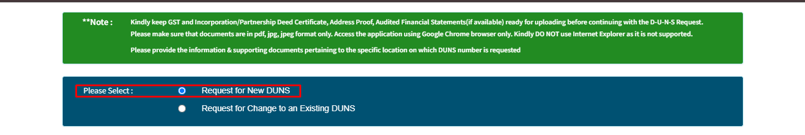
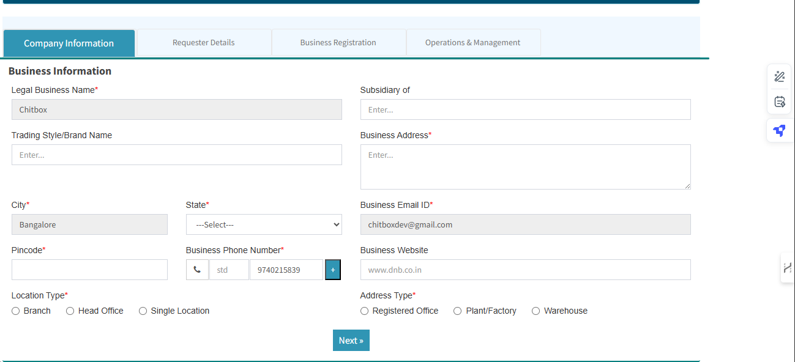
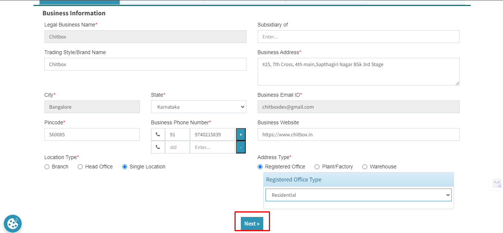
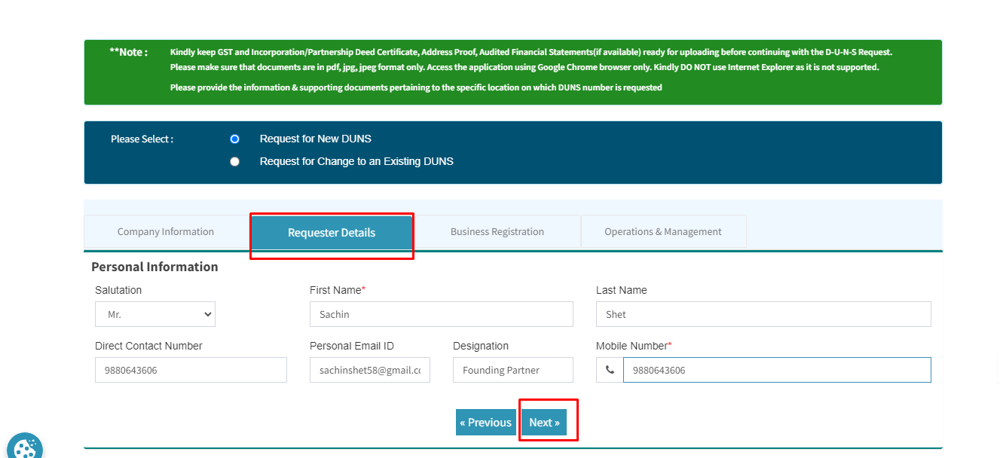
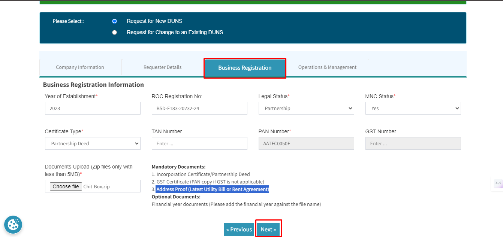
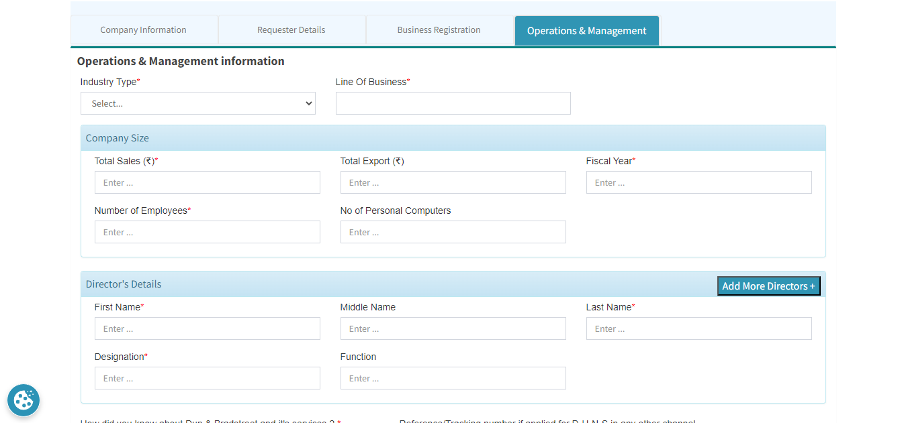
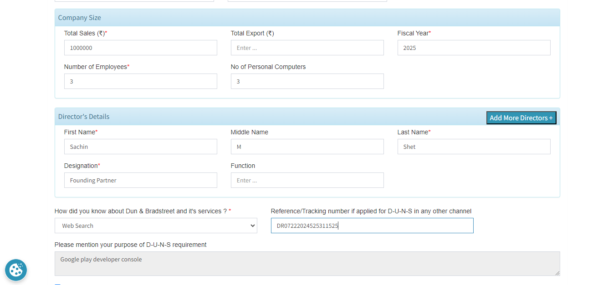
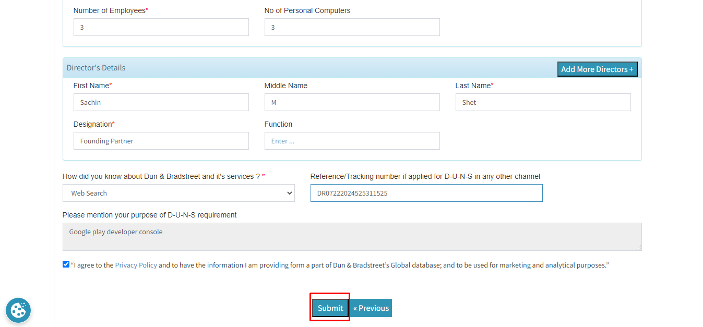
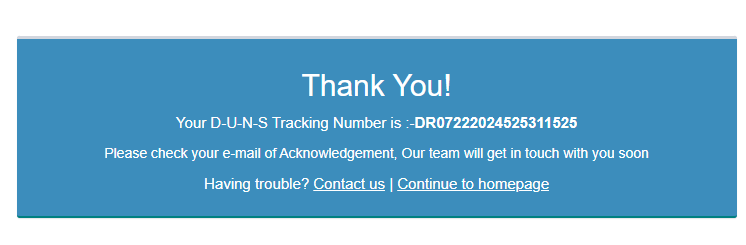
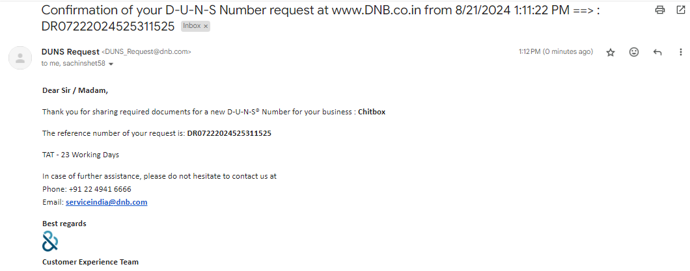

# DUNS Registration formalities

The D-U-N-S Number (Data Universal Numbering System) is a unique nine-digit identifier assigned by Dun & Bradstreet (D&B) to businesses worldwide. It helps verify a company’s legitimacy and track its financial and operational health. Here’s a breakdown of what it is and how it’s used:

## What is a D-U-N-S Number?

A D-U-N-S Number is like a digital fingerprint for businesses. Each number is unique to a business location and serves as a universal identifier.  
It’s used globally to identify over 330 million businesses across various sectors.  
D-U-N-S is essential in establishing business credit, differentiating locations within the same company, and facilitating partnerships with government agencies and other organizations.

## Steps to get a D-U-N-S Number

[Get a D-U-N-S Number - Establish Your Business - D&B](https://www.dnb.co.in/dunsrequest/transaction/duns_request.aspx?UniqueID=DR07222024525311525)

Step 1:  Select Request for New DUNS 

Fill in above Details 

Step 2 : Fill in Business Information

 Step 3 : Requester Details :

Step 4: Business-Registration :

Step 5: Operations Registration 

Confirmation Email from DUNS:

[Confirmation of your D-U-N-S Number request at www.DNB.co.in from 8_21_2024 1_11_22 PM ==_ _ DR07222024525311525.pdf](./Images/DUNSConfirmation.pdf)