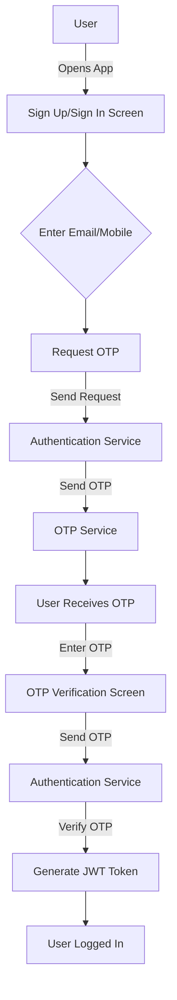
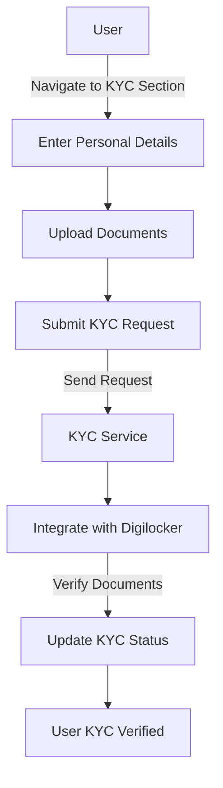
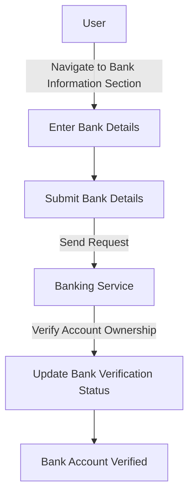
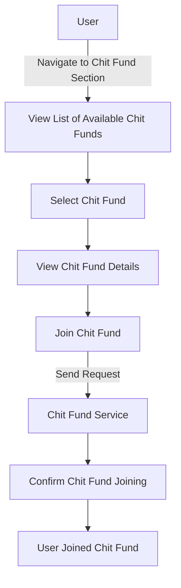
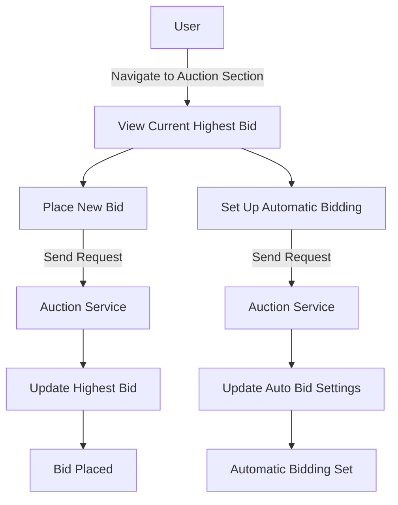
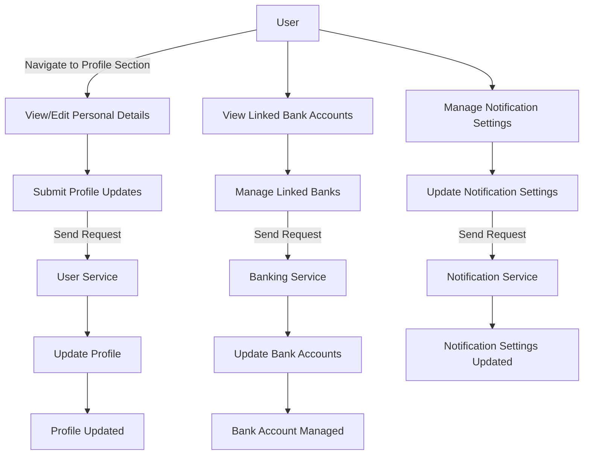

# System design(LLD +HLD)

Status: Done
Team: Engineering

### Chit-Box App System Design: High-Level Overview

### Objective:

Design a simplified high-level system architecture for ChitBox, ensuring that it is comprehensible to non-technical stakeholders while effectively communicating the key components and their interactions.

### 1. Introduction

ChitBox is a digital platform aimed at simplifying and modernizing the traditional chit fund process. This document outlines the design, features for Phase One, and the rationale behind data collection from users.

### 2. Phase One Features

Phase One of ChitBox focuses on essential functionalities that enable users to join, manage, and participate in chit funds seamlessly.

### System Architecture

### Key Components:

1. **User Interface (UI)**
2. **API Gateway**
3. **Authentication Service**
4. **User Service**
5. **KYC Verification Service**
6. **Banking Service**
7. **Chit Fund Management Service**
8. **Bidding System**
9. **Notification Service**
10. **Database**
11. **External Integrations**

### Architecture Diagram:


### Component Descriptions:

1. **User Interface (UI):**
    - **Frontend:** Built using Flutter for cross-platform support (iOS, Android).
    - **Functionality:** Registration, authentication, KYC submission, viewing/joining chit funds, bidding in auctions, profile management.
2. **API Gateway:**
    - **Role:** Acts as a single entry point for all client requests. It routes requests to the appropriate backend services.
    - **Features:** Load balancing, request authentication, rate limiting.
3. **Authentication Service:**
    - **Role:** Manages user sign-up, login, and two-factor authentication (2FA) via OTP.
    - **Technology:** JWT-based authentication.
4. **User Service:**
    - **Role:** Handles user-related operations like profile management and storing user details.
    - **Interactions:** Communicates with the Authentication Service and KYC Verification Service.
5. **KYC Verification Service:**
    - **Role:** Integrates with Digilocker for document verification and handles KYC-related data processing.
    - **Features:** Personal and identification details verification.
6. **Banking Service:**
    - **Role:** Manages collection and verification of bank details.
    - **Functionality:** Adds bank details, verifies account ownership.
7. **Chit Fund Management Service:**
    - **Role:** Manages chit funds, including viewing available chit funds, joining them, and viewing details.
    - **Interactions:** Communicates with the Bidding System and Notification Service.
8. **Bidding System:**
    - **Role:** Manages live auctions and automatic bidding for chit funds.
    - **Features:** Real-time bidding, automatic bid setup.
9. **Notification Service:**
    - **Role:** Sends real-time notifications to users for bids, fund status, upcoming payments, and auctions.
    - **Technology:** Push notifications, SMS, and email alerts.
10. **Database:**
    - **Type:** PostgreSQL for relational data, with possible integration of Redis for caching.
    - **Role:** Stores user data, KYC information, bank details, chit fund details, and bidding history.
11. **External Integrations:**
    - **Digilocker API:** For KYC verification.
    - **Banking APIs:** For account verification.

### System Workflow:

1. **User Registration and Authentication:**
    - User signs up via email or mobile number.
    - OTP sent for 2FA.
    - User selects role (User/Agent).
2. **KYC Verification:**
    - User submits personal and identification details.
    - Digilocker API used for document verification.
    - KYC status updated in the User Service.
3. **Bank Information:**
    - User enters bank details.
    - Banking Service verifies account ownership.
4. **Chit Fund Management:**
    - User views available chit funds.
    - User joins a chit fund.
    - Chit Fund Management Service updates user participation.
5. **Bidding System:**
    - User participates in live auctions.
    - Real-time bids updated and managed.
    - Automatic bidding feature can be configured.
6. **Notifications:**
    - User receives real-time updates on bids, chit fund status, and upcoming payments.

### Data Flow Diagram:

```
+-------------------+       +--------------+       +------------------+
| User Interface    | <---> | API Gateway  | <---> | Authentication   |
| (Flutter App)     |       +--------------+       | Service          |
+-------------------+       +--------------+       +------------------+
       |                        |                        |
       v                        v                        v
+-------------------+       +--------------+       +------------------+
| KYC Verification  | <---> | User Service | <---> | Banking Service  |
| Service           |       +--------------+       +------------------+
+-------------------+             |
       |                           v
       v                 +------------------+
+-------------------+    | Chit Fund        |
| Notification      |<--> | Management      |
| Service           |    | Service          |
+-------------------+    +------------------+
       |
       v
+-------------------+
| Bidding System    |
+-------------------+

```

### Security Measures:

1. **Encryption:** AES-256 encryption for sensitive data.
2. **Authentication:** Two-factor authentication (2FA) and OAuth for third-party integrations.
3. **Data Masking:** Mask personal data displayed in the app.
4. **Regular Audits:** Periodic security audits and compliance checks.

### Conclusion

This high-level system design provides a simplified yet comprehensive view of ChitBox's architecture. It outlines the essential components, their interactions, and the data flow, ensuring a secure and efficient platform for managing chit funds. This approach ensures that both technical and non-technical stakeholders can understand the system's functionality and design.

### ChitBox High-Level System Design

### Objective:

To provide a clear and simple understanding of the ChitBox system architecture, enabling non-technical stakeholders to grasp how the platform works.

### 1. Introduction

ChitBox is a digital platform designed to simplify and modernize the traditional chit fund process. The system allows users to join, manage, and participate in chit funds easily.

### 2. Phase One Features

The initial phase of ChitBox focuses on essential functionalities such as user registration, KYC (Know Your Customer) verification, bank information management, chit fund management, bidding, notifications, and user profile management.

### System Architecture Overview

The system architecture consists of the following key components:

1. **User Interface (UI)**
2. **API Gateway**
3. **Authentication Service**
4. **User Service**
5. **KYC Verification Service**
6. **Banking Service**
7. **Chit Fund Management Service**
8. **Bidding System**
9. **Notification Service**
10. **Database**
11. **External Integrations**

### Key Components Explained

1. **User Interface (UI)**
    - **What It Is:** The part of the system that users interact with directly, typically through a mobile app or website.
    - **Functionality:** Allows users to register, log in, submit KYC documents, view and join chit funds, participate in auctions, and manage their profiles.
    - **Technology:** Developed using Flutter for creating cross-platform mobile applications.
2. **API Gateway**
    - **What It Is:** A single entry point for all client requests.
    - **Functionality:** Routes incoming requests to the appropriate backend services and ensures secure communication.
    - **Benefits:** Simplifies client-server interactions, improves security, and handles load balancing.
3. **Authentication Service**
    - **What It Is:** Manages user registration and login processes.
    - **Functionality:** Handles sign-ups, logins, and two-factor authentication (2FA) using OTPs (one-time passwords).
    - **Benefits:** Ensures secure access to the system.
4. **User Service**
    - **What It Is:** Manages user-related data and operations.
    - **Functionality:** Stores and handles user details, profile management, and interactions with the KYC service.
    - **Benefits:** Centralizes user information and profile management.
5. **KYC Verification Service**
    - **What It Is:** Handles verification of user identity and documents.
    - **Functionality:** Integrates with Digilocker for document verification and processes KYC-related data.
    - **Benefits:** Ensures compliance with regulatory requirements and builds trust by verifying user identities.
6. **Banking Service**
    - **What It Is:** Manages the collection and verification of users' bank details.
    - **Functionality:** Stores bank account information and verifies account ownership.
    - **Benefits:** Ensures accurate and secure financial transactions.
7. **Chit Fund Management Service**
    - **What It Is:** Manages the lifecycle of chit funds.
    - **Functionality:** Allows users to view available chit funds, join them, and view detailed information about each fund.
    - **Benefits:** Centralizes chit fund operations and data.
8. **Bidding System**
    - **What It Is:** Manages the auction process for chit funds.
    - **Functionality:** Provides real-time bidding features and supports automatic bidding setups.
    - **Benefits:** Facilitates fair and transparent bidding processes.
9. **Notification Service**
    - **What It Is:** Manages notifications and alerts to users.
    - **Functionality:** Sends real-time notifications for bids, fund statuses, upcoming payments, and auctions via push notifications, SMS, and emails.
    - **Benefits:** Keeps users informed and engaged.
10. **Database**
    - **What It Is:** Stores all the data used by the system.
    - **Functionality:** Maintains user information, KYC details, bank data, chit fund records, and bidding histories.
    - **Technology:** Uses PostgreSQL for relational data storage and Redis for caching.
    - **Benefits:** Ensures data integrity and performance.
11. **External Integrations**
    - **What It Is:** Interfaces with external systems for additional functionalities.
    - **Functionality:** Integrates with Digilocker for KYC verification and banking APIs for account verification.
    - **Benefits:** Enhances system capabilities by leveraging external services.

### System Workflow:

### User Registration and Authentication

1. **User Sign-Up/Login:**
    - Users register or log in using their email or mobile number.
    - OTP is sent for two-factor authentication.
    - Users select their role (User or Agent).

### KYC Verification

1. **KYC Document Submission:**
    - Users submit personal details and identification documents.
    - KYC Verification Service checks documents via Digilocker.
    - Verification status is updated.

### Bank Information

1. **Bank Details Submission:**
    - Users enter their bank account details.
    - Banking Service verifies the ownership of the account.

### Chit Fund Management

1. **View and Join Chit Funds:**
    - Users browse available chit funds.
    - Users join chosen chit funds.
    - Chit Fund Management Service records participation.

### Bidding System

1. **Auction Participation:**
    - Users participate in live auctions.
    - Bidding System handles real-time bid updates and automatic bidding.

### Notifications

1. **Receive Notifications:**
    - Users get real-time updates on bids, fund status, and payment reminders through the Notification Service.

### Data Flow Diagram (Simplified):

```
+-------------------+       +--------------+       +------------------+
| User Interface    | <---> | API Gateway  | <---> | Authentication   |
| (Mobile App)      |       +--------------+       | Service          |
+-------------------+       +--------------+       +------------------+
       |                        |                        |
       v                        v                        v
+-------------------+       +--------------+       +------------------+
| KYC Verification  | <---> | User Service | <---> | Banking Service  |
| Service           |       +--------------+       +------------------+
+-------------------+             |
       |                           v
       v                 +------------------+
+-------------------+    | Chit Fund        |
| Notification      |<--> | Management      |
| Service           |    | Service          |
+-------------------+    +------------------+
       |
       v
+-------------------+
| Bidding System    |
+-------------------+

```

### Security Measures:

1. **Encryption:** All sensitive data is encrypted using AES-256 encryption.
2. **Authentication:** Users must pass two-factor authentication (2FA) and OAuth is used for third-party integrations.
3. **Data Masking:** Personal data displayed in the app is masked to prevent unauthorized access.
4. **Regular Audits:** Security audits and compliance checks are conducted periodically to ensure system integrity.

### Conclusion

This high-level system design provides a clear and simplified view of ChitBox's architecture. By outlining the key components and their interactions, the design ensures that non-technical stakeholders can understand the system's functionality and workflow. This approach highlights the system's security, data flow, and essential services, providing a comprehensive overview of the ChitBox platform.

### Low-Level Design (LLD) for ChitBox

---

### 1. User Registration and Authentication

### 1.1 Workflow Diagram

**User Registration and Authentication Workflow:**

1. User opens the app.
2. User selects Sign Up/Sign In.
3. User enters email/mobile number.
4. System sends OTP to the provided email/mobile.
5. User enters OTP.
6. System verifies OTP.
7. User is registered/logged in.

[https://example.com/authentication-workflow](https://example.com/authentication-workflow)

### 1.2 Detailed Design

**Components**:

- **Sign Up/Sign In Screen**:
    - **Inputs**: Email/Mobile, OTP
    - **Buttons**: Request OTP, Verify OTP

**API Endpoints**:

- `POST /api/auth/signup`
    - **Request**:
        
        ```json
        {
          "email_or_mobile": "string"
        }
        
        ```
        
    - **Response**:
        
        ```json
        {
          "otp_sent": true
        }
        
        ```
        
- `POST /api/auth/signin`
    - **Request**:
        
        ```json
        {
          "email_or_mobile": "string"
        }
        
        ```
        
    - **Response**:
        
        ```json
        {
          "otp_sent": true
        }
        
        ```
        
- `POST /api/auth/verify-otp`
    - **Request**:
        
        ```json
        {
          "email_or_mobile": "string",
          "otp": "string"
        }
        
        ```
        
    - **Response**:
        
        ```json
        {
          "token": "jwt_token",
          "user_id": "string"
        }
        
        ```
        

---

### 2. KYC Verification

### 2.1 Workflow Diagram

**KYC Verification Workflow:**

1. User navigates to KYC section.
2. User fills in personal details (Name, DOB, Address).
3. User uploads documents (Aadhar, PAN).
4. System integrates with Digilocker to verify documents.
5. System updates KYC status.

[https://example.com/kyc-workflow](https://example.com/kyc-workflow)

### 2.2 Detailed Design

**Components**:

- **Personal Details Form**:
    - **Fields**: Name, DOB, Address
- **Document Upload Form**:
    - **Fields**: Aadhar, PAN
    - **Button**: Digilocker Integration

**API Endpoints**:

- `POST /api/kyc/verify`
    - **Request**:
        
        ```json
        {
          "name": "string",
          "dob": "YYYY-MM-DD",
          "address": "string",
          "aadhar": "string",
          "pan": "string"
        }
        
        ```
        
    - **Response**:
        
        ```json
        {
          "kyc_status": "pending"
        }
        
        ```
        
- `GET /api/kyc/status`
    - **Request**:
        
        ```json
        {
          "user_id": "string"
        }
        
        ```
        
    - **Response**:
        
        ```json
        {
          "kyc_status": "verified"
        }
        
        ```
        

---

### 3. Bank Information

### 3.1 Workflow Diagram

**Bank Information Workflow:**

1. User navigates to Bank Information section.
2. User fills in bank details (Account Number, IFSC Code).
3. User clicks on verify button.
4. System verifies account ownership.
5. System updates bank verification status.

[https://example.com/bank-info-workflow](https://example.com/bank-info-workflow)

### 3.2 Detailed Design

**Components**:

- **Bank Details Form**:
    - **Fields**: Account Number, IFSC Code
    - **Button**: Verify Account

**API Endpoints**:

- `POST /api/bank/add`
    - **Request**:
        
        ```json
        {
          "account_number": "string",
          "ifsc_code": "string"
        }
        
        ```
        
    - **Response**:
        
        ```json
        {
          "bank_status": "verification_pending"
        }
        
        ```
        
- `GET /api/bank/verify`
    - **Request**:
        
        ```json
        {
          "user_id": "string"
        }
        
        ```
        
    - **Response**:
        
        ```json
        {
          "bank_status": "verified"
        }
        
        ```
        

---

### 4. Chit Fund Management

### 4.1 Workflow Diagram

**Chit Fund Management Workflow:**

1. User navigates to Chit Fund section.
2. User views list of available chit funds.
3. User selects a chit fund to view details.
4. User joins the selected chit fund.

[https://example.com/chit-fund-management-workflow](https://example.com/chit-fund-management-workflow)

### 4.2 Detailed Design

**Components**:

- **Chit Fund List**:
    - **Display**: List of chit funds
- **Chit Fund Details**:
    - **Display**: Detailed information about a chit fund
    - **Button**: Join Chit Fund

**API Endpoints**:

- `GET /api/chitfunds`
    - **Response**:
        
        ```json
        {
          "chitfunds": [
            {
              "id": "string",
              "name": "string",
              "amount": "number",
              "premium": "number",
              "start_date": "YYYY-MM-DD",
              "slots": "number"
            }
          ]
        }
        
        ```
        
- `GET /api/chitfunds/:id`
    - **Request**:
        
        ```json
        {
          "chitfund_id": "string"
        }
        
        ```
        
    - **Response**:
        
        ```json
        {
          "id": "string",
          "name": "string",
          "amount": "number",
          "premium": "number",
          "start_date": "YYYY-MM-DD",
          "slots": "number"
        }
        
        ```
        
- `POST /api/chitfunds/join`
    - **Request**:
        
        ```json
        {
          "user_id": "string",
          "chitfund_id": "string"
        }
        
        ```
        
    - **Response**:
        
        ```json
        {
          "status": "joined"
        }
        
        ```
        

---

### 5. Bidding System

### 5.1 Workflow Diagram

**Bidding System Workflow:**

1. User navigates to the Auction section.
2. User views current highest bid.
3. User places a new bid.
4. User sets up automatic bidding if desired.
5. Auction concludes and user is notified of the result.

[https://example.com/bidding-system-workflow](https://example.com/bidding-system-workflow)

### 5.2 Detailed Design

**Components**:

- **Live Auction Screen**:
    - **Display**: Current highest bid, new bid input field
    - **Button**: Place Bid
- **Automatic Bid Setup**:
    - **Fields**: Min Bid, Max Bid
    - **Button**: Save

**API Endpoints**:

- `GET /api/auction/:id`
    - **Request**:
        
        ```json
        {
          "auction_id": "string"
        }
        
        ```
        
    - **Response**:
        
        ```json
        {
          "current_bid": "number",
          "auction_end_time": "YYYY-MM-DDTHH:MM:SSZ"
        }
        
        ```
        
- `POST /api/auction/bid`
    - **Request**:
        
        ```json
        {
          "user_id": "string",
          "auction_id": "string",
          "bid_amount": "number"
        }
        
        ```
        
    - **Response**:
        
        ```json
        {
          "status": "bid_placed"
        }
        
        ```
        
- `POST /api/auction/auto-bid`
    - **Request**:
        
        ```json
        {
          "user_id": "string",
          "auction_id": "string",
          "min_bid": "number",
          "max_bid": "number"
        }
        
        ```
        
    - **Response**:
        
        ```json
        {
          "status": "auto_bid_set"
        }
        
        ```
        

---

### 6. Notifications

### 6.1 Workflow Diagram

**Notifications Workflow:**

1. System generates notifications based on user actions.
2. User receives real-time notifications.
3. User views notifications.
4. User manages notification settings.

[https://example.com/notifications-workflow](https://example.com/notifications-workflow)

### 6.2 Detailed Design

**Components**:

- **Notification List**:
    - **Display**: List of notifications
    - **Option**: Mark as Read
- **Notification Settings**:
    - **Toggle**: Enable/Disable notifications

**API Endpoints**:

- `GET /api/notifications`
    - **Request**:
        
        ```json
        {
          "user_id": "string"
        }
        
        ```
        
    - **Response**:
        
        ```json
        {
          "notifications": [
            {
              "id": "string",
              "type": "string",
              "message": "string",
              "read": "boolean"
            }
          ]
        }
        
        ```
        
- `POST /api/notifications/read`
    - **Request**:
        
        ```json
        {
          "notification_id": "string"
        }
        
        ```
        
    - **Response**:
        
        ```json
        {
          "status": "read"
        }
        
        ```
        

---

### 7. User Profile

Management

### 7.1 Workflow Diagram

**User Profile Management Workflow:**

1. User navigates to Profile section.
2. User edits personal details.
3. User views linked bank accounts.
4. User manages notification settings.

[https://example.com/profile-management-workflow](https://example.com/profile-management-workflow)

### 7.2 Detailed Design

**Components**:

- **Profile Edit Form**:
    - **Fields**: Name, DOB, Address
    - **Button**: Save
- **Linked Banks List**:
    - **Display**: List of linked bank accounts
    - **Options**: Edit, Remove
- **Notification Settings**:
    - **Toggle**: Enable/Disable notifications

**API Endpoints**:

- `GET /api/profile`
    - **Request**:
        
        ```json
        {
          "user_id": "string"
        }
        
        ```
        
    - **Response**:
        
        ```json
        {
          "name": "string",
          "dob": "YYYY-MM-DD",
          "address": "string"
        }
        
        ```
        
- `POST /api/profile/update`
    - **Request**:
        
        ```json
        {
          "user_id": "string",
          "name": "string",
          "dob": "YYYY-MM-DD",
          "address": "string"
        }
        
        ```
        
    - **Response**:
        
        ```json
        {
          "status": "updated"
        }
        
        ```
        
- `GET /api/banks`
    - **Request**:
        
        ```json
        {
          "user_id": "string"
        }
        
        ```
        
    - **Response**:
        
        ```json
        {
          "banks": [
            {
              "id": "string",
              "account_number": "string",
              "ifsc_code": "string"
            }
          ]
        }
        
        ```
        
- `POST /api/banks/add`
    - **Request**:
        
        ```json
        {
          "user_id": "string",
          "account_number": "string",
          "ifsc_code": "string"
        }
        
        ```
        
    - **Response**:
        
        ```json
        {
          "status": "added"
        }
        
        ```
        
- `DELETE /api/banks/:id`
    - **Request**:
        
        ```json
        {
          "bank_id": "string"
        }
        
        ```
        
    - **Response**:
        
        ```json
        {
          "status": "removed"
        }
        
        ```
        

---

This low-level design (LLD) provides detailed workflows, component descriptions, and API specifications for the ChitBox app, ensuring clear guidelines for developers and a comprehensive understanding of the system's inner workings.

### High-Level Design (HLD) Flow Chart and Workflow for ChitBox

### 1. HLD Flow Chart

**Architecture Overview:**

```
                +-------------------------+
                |      Mobile/Web App      |
                +-----------+-------------+
                            |
                            |
                            v
                +-----------+-------------+
                |        Authentication Service        |
                +-----------+-------------+
                            |
                            v
                +-----------+-------------+
                |           KYC Service            |
                +-----------+-------------+
                            |
                            v
                +-----------+-------------+
                |         Banking Service        |
                +-----------+-------------+
                            |
                            v
                +-----------+-------------+
                |        Chit Fund Service       |
                +-----------+-------------+
                            |
                            v
                +-----------+-------------+
                |         Auction Service         |
                +-----------+-------------+
                            |
                            v
                +-----------+-------------+
                |       Notification Service      |
                +-----------+-------------+
                            |
                            v
                +-----------+-------------+
                |          User Service           |
                +-------------------------+

```

---

### 2. HLD Workflow

**User Registration and Authentication:**

1. User opens the Mobile/Web App.
2. User selects Sign Up/Sign In.
3. User enters email/mobile number.
4. Authentication Service sends OTP to the provided email/mobile.
5. User enters OTP.
6. Authentication Service verifies OTP.
7. User is registered/logged in.

**KYC Verification:**

1. User navigates to the KYC section in the app.
2. User fills in personal details (Name, DOB, Address).
3. User uploads documents (Aadhar, PAN).
4. KYC Service integrates with Digilocker to verify documents.
5. KYC Service updates the KYC status.

**Bank Information:**

1. User navigates to the Bank Information section in the app.
2. User fills in bank details (Account Number, IFSC Code).
3. User clicks on the verify button.
4. Banking Service verifies account ownership.
5. Banking Service updates bank verification status.

**Chit Fund Management:**

1. User navigates to the Chit Fund section in the app.
2. User views a list of available chit funds.
3. User selects a chit fund to view details.
4. User joins the selected chit fund.

**Bidding System:**

1. User navigates to the Auction section in the app.
2. User views the current highest bid.
3. User places a new bid.
4. User sets up automatic bidding if desired.
5. Auction concludes, and the user is notified of the result.

**Notifications:**

1. System generates notifications based on user actions.
2. User receives real-time notifications.
3. User views notifications in the app.
4. User manages notification settings.

**User Profile Management:**

1. User navigates to the Profile section in the app.
2. User edits personal details.
3. User views linked bank accounts.
4. User manages notification settings.

---

### HLD Workflow Diagram

Here's a visual representation of the high-level workflow for ChitBox:

[https://example.com/hld-workflow-diagram](https://example.com/hld-workflow-diagram)

---

### Detailed Workflow for Key Features

**1. User Registration and Authentication**

```
+---------------------------+
| Mobile/Web App            |
|---------------------------|
| - User selects Sign Up/In |
| - User enters details     |
+------------+--------------+
             |
             v
+------------+--------------+
| Authentication Service    |
|---------------------------|
| - Sends OTP               |
| - Verifies OTP            |
+---------------------------+

```

**2. KYC Verification**

```
+---------------------------+
| Mobile/Web App            |
|---------------------------|
| - User enters KYC details |
| - Uploads documents       |
+------------+--------------+
             |
             v
+------------+--------------+
| KYC Service               |
|---------------------------|
| - Verifies details        |
| - Integrates with Digilocker |
+---------------------------+

```

**3. Bank Information**

```
+---------------------------+
| Mobile/Web App            |
|---------------------------|
| - User enters bank details|
| - Verifies account        |
+------------+--------------+
             |
             v
+------------+--------------+
| Banking Service           |
|---------------------------|
| - Verifies account ownership |
+---------------------------+

```

**4. Chit Fund Management**

```
+---------------------------+
| Mobile/Web App            |
|---------------------------|
| - Views chit funds        |
| - Joins selected chit fund|
+------------+--------------+
             |
             v
+------------+--------------+
| Chit Fund Service         |
|---------------------------|
| - Manages chit funds      |
+---------------------------+

```

**5. Bidding System**

```
+---------------------------+
| Mobile/Web App            |
|---------------------------|
| - User views bids         |
| - Places new bid          |
| - Sets automatic bids     |
+------------+--------------+
             |
             v
+------------+--------------+
| Auction Service           |
|---------------------------|
| - Manages auctions        |
+---------------------------+

```

**6. Notifications**

```
+---------------------------+
| Mobile/Web App            |
|---------------------------|
| - Views notifications     |
| - Manages settings        |
+------------+--------------+
             |
             v
+------------+--------------+
| Notification Service      |
|---------------------------|
| - Sends notifications     |
+---------------------------+

```

**7. User Profile Management**

```
+---------------------------+
| Mobile/Web App            |
|---------------------------|
| - Edits profile details   |
| - Manages bank accounts   |
| - Manages notification settings |
+------------+--------------+
             |
             v
+------------+--------------+
| User Service              |
|---------------------------|
| - Manages user data       |
+---------------------------+

```

---

This high-level design flow chart and workflow provide a comprehensive overview of the ChitBox system's architecture and interactions, ensuring a clear understanding of the system for both technical and non-technical stakeholders.

### Low-Level Design (LLD) Flowchart and Implementation for ChitBox

---

### 1. User Registration and Authentication

### 1.1 Flowchart

**User Registration and Authentication Flowchart:**



### 1.2 Implementation

**Components:**

- **Sign Up/Sign In Screen**:
    - **Inputs**: Email/Mobile
    - **Buttons**: Request OTP, Verify OTP

**API Endpoints:**

- `POST /api/auth/signup`
    - **Request**:
        
        ```json
        {
          "email_or_mobile": "string"
        }
        
        ```
        
    - **Response**:
        
        ```json
        {
          "otp_sent": true
        }
        
        ```
        
- `POST /api/auth/signin`
    - **Request**:
        
        ```json
        {
          "email_or_mobile": "string"
        }
        
        ```
        
    - **Response**:
        
        ```json
        {
          "otp_sent": true
        }
        
        ```
        
- `POST /api/auth/verify-otp`
    - **Request**:
        
        ```json
        {
          "email_or_mobile": "string",
          "otp": "string"
        }
        
        ```
        
    - **Response**:
        
        ```json
        {
          "token": "jwt_token",
          "user_id": "string"
        }
        
        ```
        

---

### 2. KYC Verification

### 2.1 Flowchart

**KYC Verification Flowchart:**



### 2.2 Implementation

**Components:**

- **Personal Details Form**:
    - **Fields**: Name, DOB, Address
- **Document Upload Form**:
    - **Fields**: Aadhar, PAN
    - **Button**: Digilocker Integration

**API Endpoints:**

- `POST /api/kyc/verify`
    - **Request**:
        
        ```json
        {
          "name": "string",
          "dob": "YYYY-MM-DD",
          "address": "string",
          "aadhar": "string",
          "pan": "string"
        }
        
        ```
        
    - **Response**:
        
        ```json
        {
          "kyc_status": "pending"
        }
        
        ```
        
- `GET /api/kyc/status`
    - **Request**:
        
        ```json
        {
          "user_id": "string"
        }
        
        ```
        
    - **Response**:
        
        ```json
        {
          "kyc_status": "verified"
        }
        
        ```
        

---

### 3. Bank Information

### 3.1 Flowchart

**Bank Information Flowchart:**



### 3.2 Implementation

**Components:**

- **Bank Details Form**:
    - **Fields**: Account Number, IFSC Code
    - **Button**: Verify Account

**API Endpoints:**

- `POST /api/bank/add`
    - **Request**:
        
        ```json
        {
          "account_number": "string",
          "ifsc_code": "string"
        }
        
        ```
        
    - **Response**:
        
        ```json
        {
          "bank_status": "verification_pending"
        }
        
        ```
        
- `GET /api/bank/verify`
    - **Request**:
        
        ```json
        {
          "user_id": "string"
        }
        
        ```
        
    - **Response**:
        
        ```json
        {
          "bank_status": "verified"
        }
        
        ```
        

---

### 4. Chit Fund Management

### 4.1 Flowchart

**Chit Fund Management Flowchart:**



### 4.2 Implementation

**Components:**

- **Chit Fund List**:
    - **Display**: List of chit funds
- **Chit Fund Details**:
    - **Display**: Detailed information about a chit fund
    - **Button**: Join Chit Fund

**API Endpoints:**

- `GET /api/chitfunds`
    - **Response**:
        
        ```json
        {
          "chitfunds": [
            {
              "id": "string",
              "name": "string",
              "amount": "number",
              "premium": "number",
              "start_date": "YYYY-MM-DD",
              "slots": "number"
            }
          ]
        }
        
        ```
        
- `GET /api/chitfunds/:id`
    - **Request**:
        
        ```json
        {
          "chitfund_id": "string"
        }
        
        ```
        
    - **Response**:
        
        ```json
        {
          "id": "string",
          "name": "string",
          "amount": "number",
          "premium": "number",
          "start_date": "YYYY-MM-DD",
          "slots": "number"
        }
        
        ```
        
- `POST /api/chitfunds/join`
    - **Request**:
        
        ```json
        {
          "user_id": "string",
          "chitfund_id": "string"
        }
        
        ```
        
    - **Response**:
        
        ```json
        {
          "status": "joined"
        }
        
        ```
        

---

### 5. Bidding System

### 5.1 Flowchart

**Bidding System Flowchart:**



### 5.2 Implementation

**Components:**

- **Live Auction Screen**:
    - **Display**: Current highest bid, new bid input field
    - **Button**: Place Bid
- **Automatic Bid Setup**:
    - **Fields**: Min Bid, Max Bid
    - **Button**: Save

**API Endpoints:**

- `GET /api/auction/:id`
    - **Request**:
        
        ```json
        {
          "auction_id": "string"
        }
        
        ```
        
    - **Response**:
        
        ```json
        {
          "current_bid": "number",
          "auction_end_time": "YYYY-MM-DDTHH:MM:SSZ"
        }
        
        ```
        
- `POST /api/auction/bid`
    - **Request**:
        
        ```json
        {
          "user_id": "string",
          "auction_id": "string",
          "bid_amount": "number"
        }
        
        ```
        
    - **Response**:
        
        ```json
        {
          "status": "bid_placed"
        }
        
        ```
        
- `POST /api/auction/auto-bid`
    - **Request**:
        
        ```json
        {
          "user_id": "string",
          "auction_id": "string",
          "min_bid": "number",
          "max_bid": "number"
        }
        
        ```
        
    - **Response**:
        
        ```json
        {
          "status": "auto_bid_set"
        }
        
        ```
        

---

### 6. Notifications

### 6.1 Flowchart

**Notifications Flowchart:**

```mermaid
flowchart TD
    A[System] -->|Generate Notification| B[Notification Service]
    B -->|Send Notification| C[User]
    C -->|View Notification| D[Notification List]
    D --> E[Mark as Read]
    E -->|Send Request| F[Notification Service]
    F --> G

[Update Notification Status]
    G --> H[Notification Marked as Read]

```

### 6.2 Implementation

**Components:**

- **Notification List**:
    - **Display**: List of notifications
    - **Option**: Mark as Read
- **Notification Settings**:
    - **Toggle**: Enable/Disable notifications

**API Endpoints:**

- `GET /api/notifications`
    - **Request**:
        
        ```json
        {
          "user_id": "string"
        }
        
        ```
        
    - **Response**:
        
        ```json
        {
          "notifications": [
            {
              "id": "string",
              "type": "string",
              "message": "string",
              "read": "boolean"
            }
          ]
        }
        
        ```
        
- `POST /api/notifications/read`
    - **Request**:
        
        ```json
        {
          "notification_id": "string"
        }
        
        ```
        
    - **Response**:
        
        ```json
        {
          "status": "read"
        }
        
        ```
        

---

### 7. User Profile Management

### 7.1 Flowchart

**User Profile Management Flowchart:**



### 7.2 Implementation

**Components:**

- **Profile Edit Form**:
    - **Fields**: Name, DOB, Address
    - **Button**: Save
- **Linked Banks List**:
    - **Display**: List of linked bank accounts
    - **Options**: Edit, Remove
- **Notification Settings**:
    - **Toggle**: Enable/Disable notifications

**API Endpoints:**

- `GET /api/profile`
    - **Request**:
        
        ```json
        {
          "user_id": "string"
        }
        
        ```
        
    - **Response**:
        
        ```json
        {
          "name": "string",
          "dob": "YYYY-MM-DD",
          "address": "string"
        }
        
        ```
        
- `POST /api/profile/update`
    - **Request**:
        
        ```json
        {
          "user_id": "string",
          "name": "string",
          "dob": "YYYY-MM-DD",
          "address": "string"
        }
        
        ```
        
    - **Response**:
        
        ```json
        {
          "status": "updated"
        }
        
        ```
        
- `GET /api/banks`
    - **Request**:
        
        ```json
        {
          "user_id": "string"
        }
        
        ```
        
    - **Response**:
        
        ```json
        {
          "banks": [
            {
              "id": "string",
              "account_number": "string",
              "ifsc_code": "string"
            }
          ]
        }
        
        ```
        
- `POST /api/banks/add`
    - **Request**:
        
        ```json
        {
          "user_id": "string",
          "account_number": "string",
          "ifsc_code": "string"
        }
        
        ```
        
    - **Response**:
        
        ```json
        {
          "status": "added"
        }
        
        ```
        
- `DELETE /api/banks/:id`
    - **Request**:
        
        ```json
        {
          "bank_id": "string"
        }
        
        ```
        
    - **Response**:
        
        ```json
        {
          "status": "removed"
        }
        
        ```
        

---

This low-level design (LLD) flowchart and implementation provide detailed workflows and component interactions for key features of the ChitBox app, ensuring clear guidelines for developers and a comprehensive understanding of the system's inner workings.