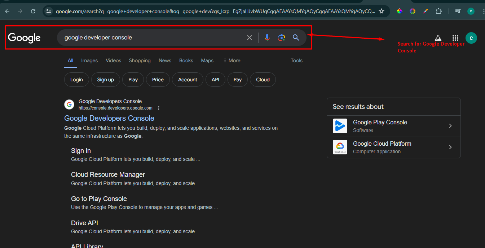
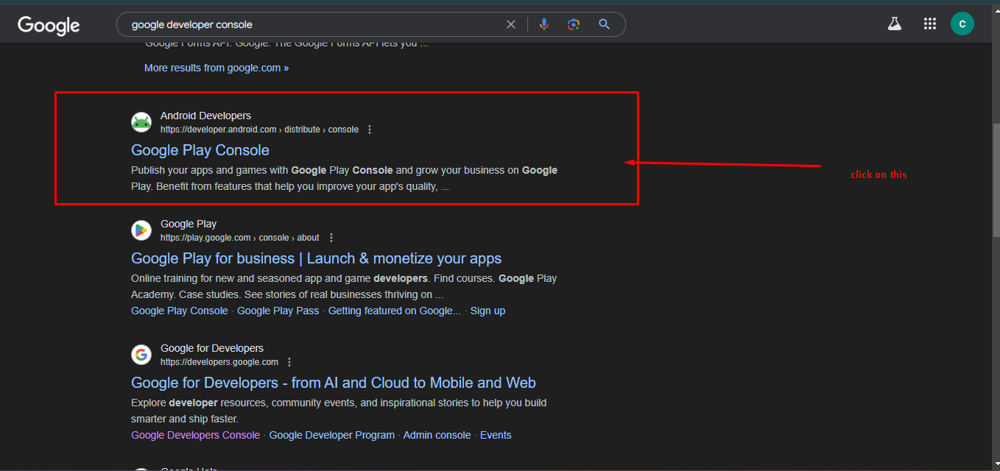
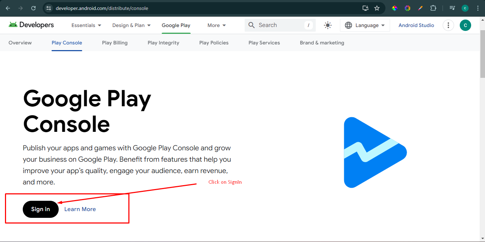
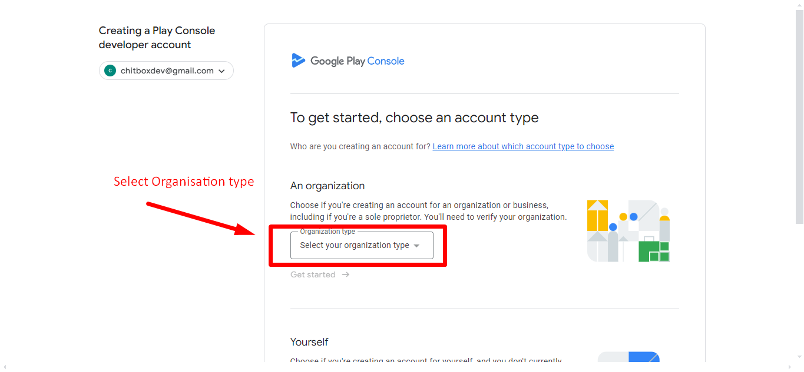
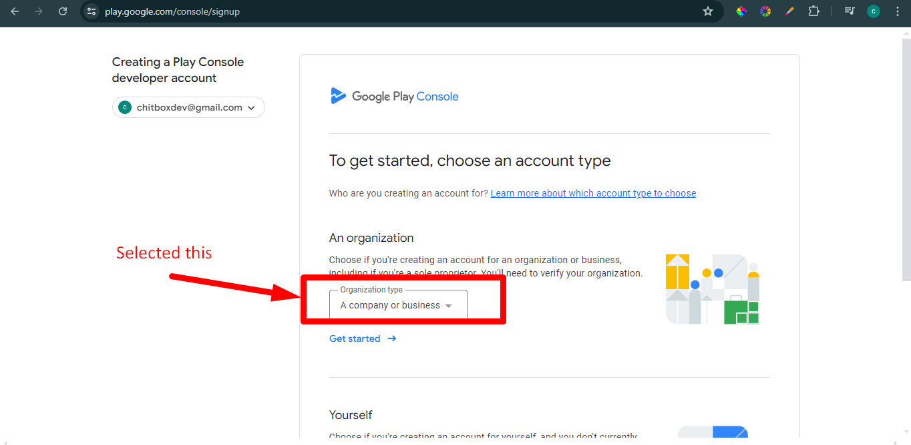
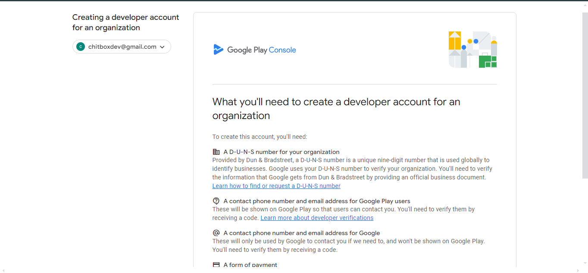
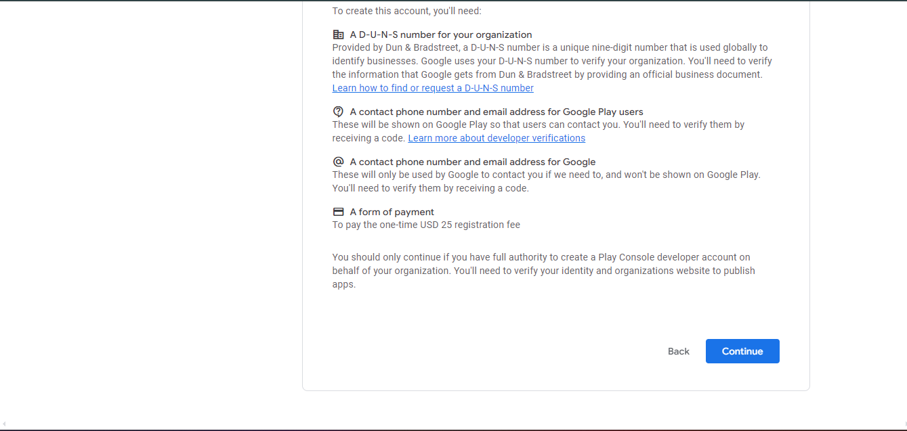
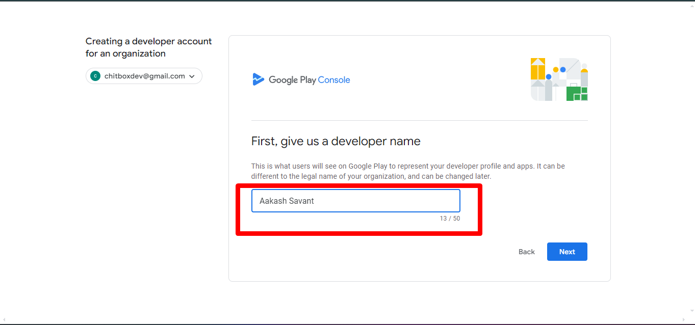
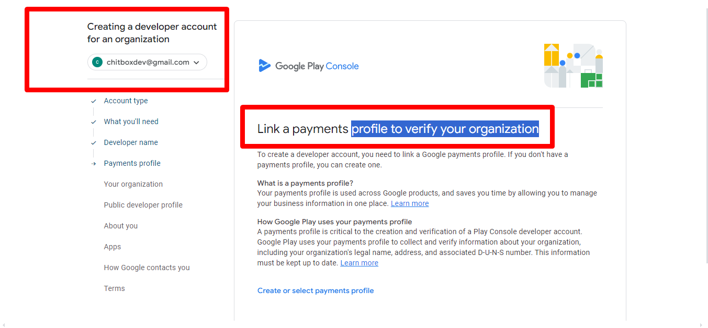
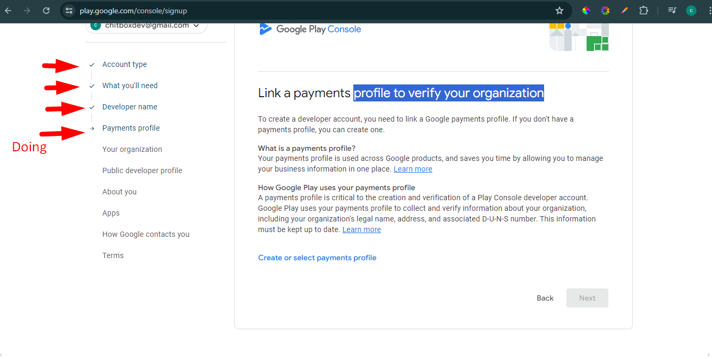

# Google playstore Account creation Account

- Step 1 : Search for  google play developer console
    
    
    
- Step 2:
    
    
    
- Step 3:  Signin with gmail
    
    
    
- Step 4: Selecting Organisation Type
    
    
    
    
    
- Step 5: Terms and condition by google
    
    
    
    
    
- Step 6: Developer Name
    
    
    
- Step 7: Linking Profile for Organization
    
    
    
- Need to be done
    
    