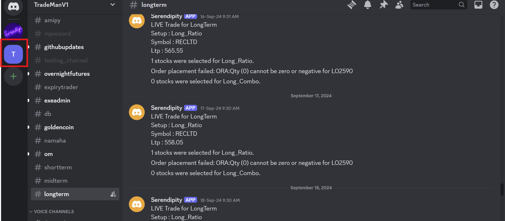
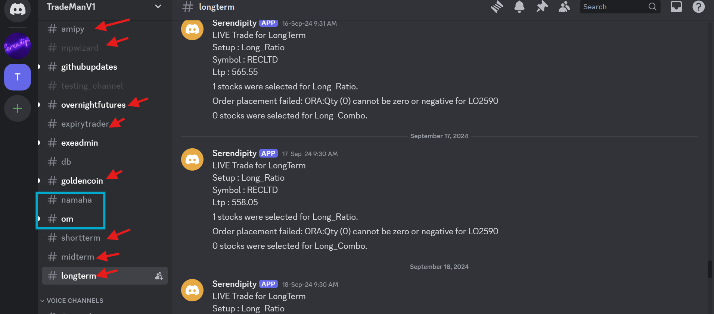
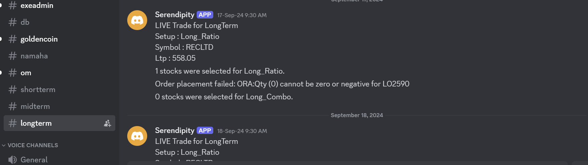
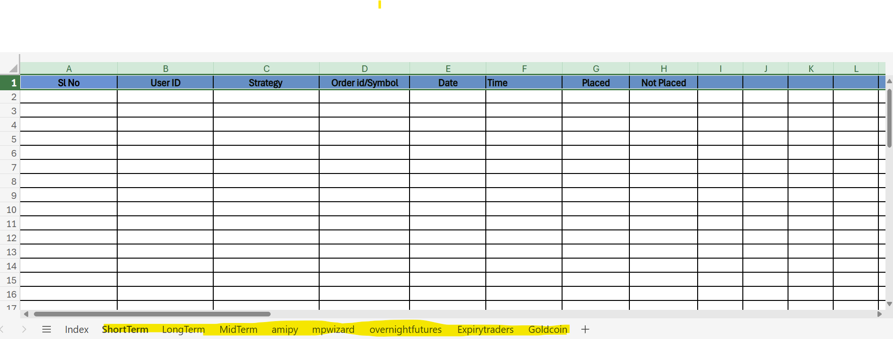

#TESTING TRADEMANV1 DISCORD 

[Excel link for discord message data[Trading]](https://1drv.ms/x/c/fde8cc733fe56ec4/Ed5tVYhVsfhJoA9BJLk-vXQBwC_EdDLpifeMWuh6vHb0BA?e=fl6eS1)

##Testing Procedure

### 1. Open discord

### 2. Select TRADEMAN

### 3.Select strategy

### 4. Check 

Check the messages in accordance with date and time

### 5.Login to firstock

### 6. Click on Positions

### 7. Compare

Now check for the trade which is showing as placed in discord is present inside Firstock's Position or not

### 8. Submit Report

The above procedure allows you to fill the excel in accordence with strategies.

Note that the index sheet contains the list of users for each strategies.