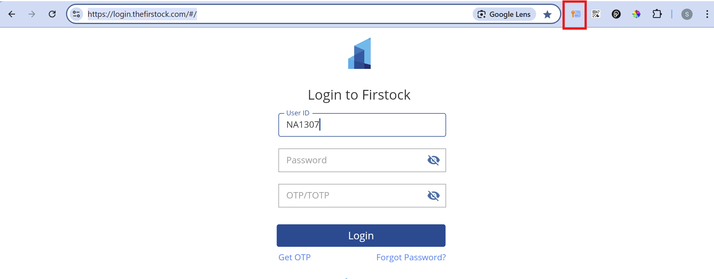
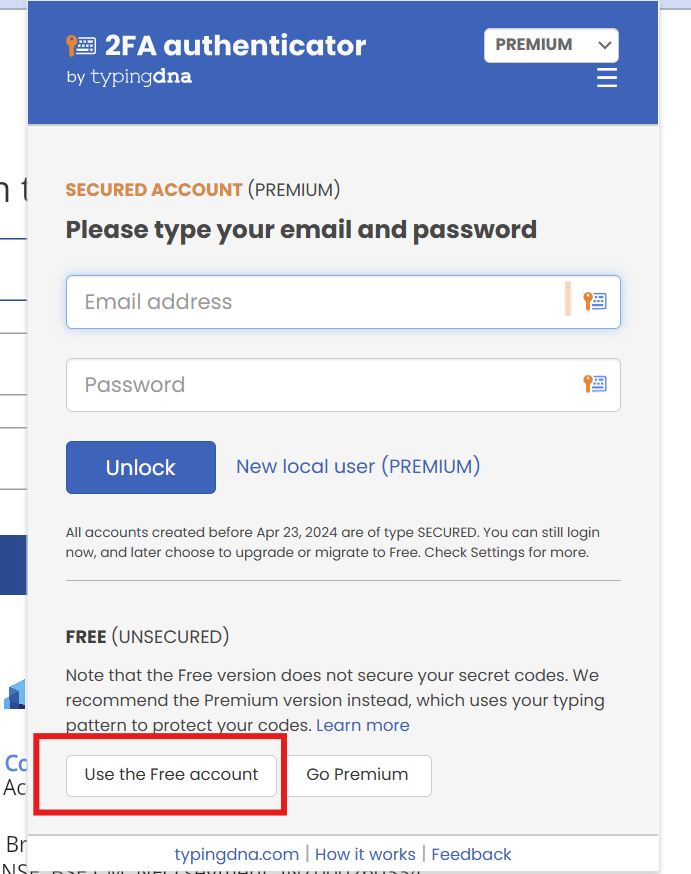
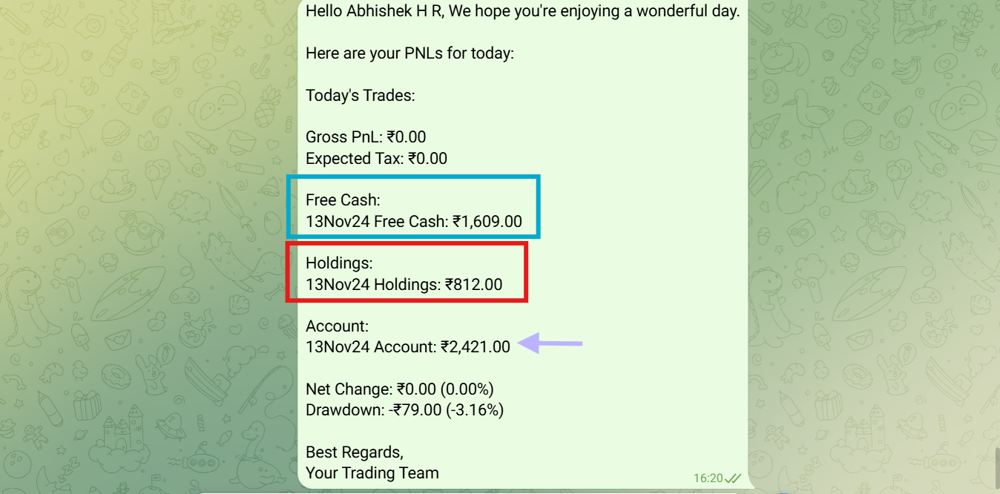
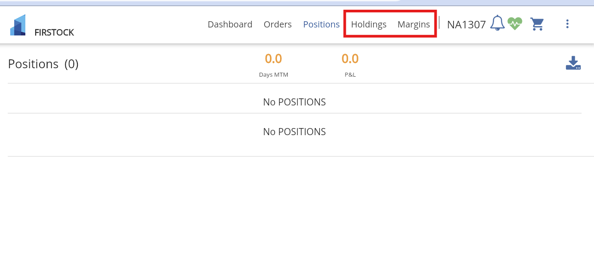
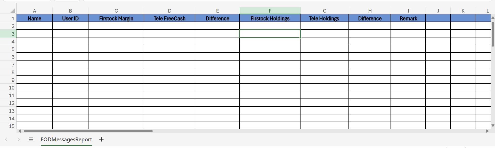

#TESTING TRADEMANV1 EOD MESSAGE

## 1. Open Telegram 

Open the telegram registered with 8618221715

This telegram contains the history of EOD messages sent automatically by our TradeMan system at 4.20

## 2. Individual EOD Report

Take up each client's EOD report and compare the values with Firstock account values by logging in to their account

## 3. Firstock Login

[Click the below link to login to firstock](https://login.thefirstock.com/#/)

Enter Client ID and Password and TOTP 

TOTO is accessible from the 2FA Authenticator app pinned on the serendipity account

Note : The client ID and password should be collected personally from the manager 

## 4. Values

### 4.1 Available Balance

**Margin** inside the Firstock account should be equal to the **FreeCash** in the EOD report.

### 4.2 Trades kept hold overnight

The purchase amount of trades which are purchased and kept hold are shown as **Holdings** in both the EOD report and Firstock account.

### 4.3 Account Value

This account value present in our Telegram EOD report should be equal to the sum of **FreeCash** and **Holdings** .

## 5. Reference Images

**Telegram Message example**

**Firstock Account**

## 6. Excel Report

By doing the above steps, you can fill the below excel report with the appropriate values

[Excel](https://1drv.ms/x/c/fde8cc733fe56ec4/EXHjAnixk-RIrIuJCj3vMhgBPruumWDS_GRBJElZ_10gRw?e=tWqkcj)

