# Google sso

### Reference Links

link: https://console.cloud.google.com/
youtube url: https://www.youtube.com/watch?v=ot9yuKg15iA

in order to integrate google sso 

## Start: install next-auth library
    
    ```dart
    npm i next-auth
    ```
    

## Step 1: OAuth Consent Screen Setup in GCP

- Step 1: OAuth Consent Screen Setup in GCP
  - Step 2: Setup GCP for SSO
    - Step 0: Create a new project in GCP
        
        <a href="./images/GCPImage1.png" style="margin-bottom: 20px; display: inline-block; border: 1px solid #ccc; padding: 10px; border-radius: 5px;">
            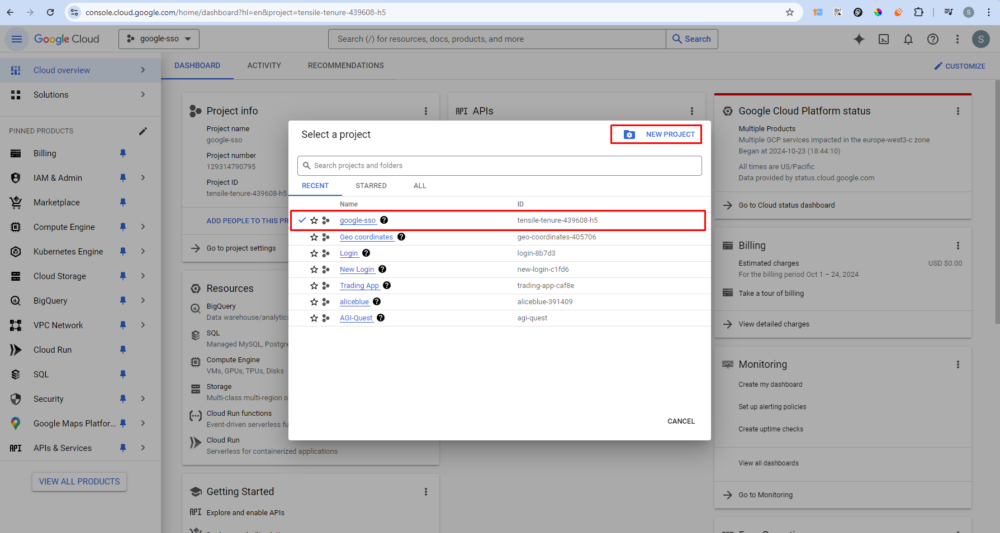
        </a>
        
    - Step 1: OAuth Consent Screen
        
        <a href="./images/GCPImage2.png" style="margin-bottom: 20px; display: inline-block; border: 1px solid #ccc; padding: 10px; border-radius: 5px;">
            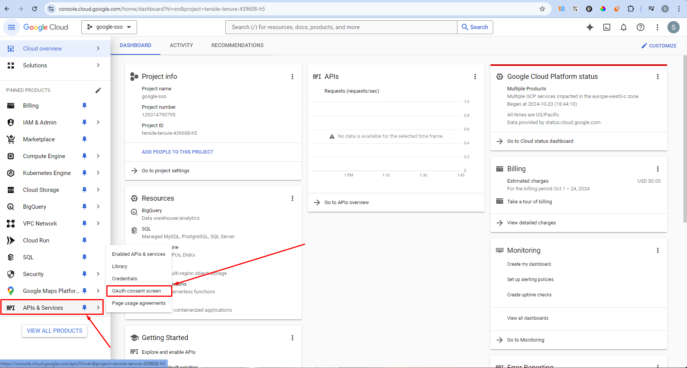
        </a>
        
        - Step 0
            
            <a href="./images/GCPImage3.png" style="margin-bottom: 20px; display: inline-block; border: 1px solid #ccc; padding: 10px; border-radius: 5px;">
                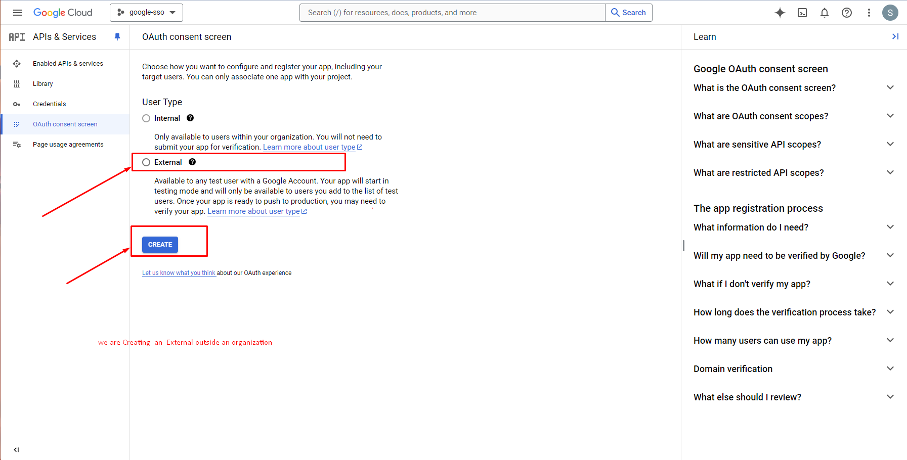
            </a>
            
        - Step 1
            
            <a href="./images/GCPImage4.png" style="margin-bottom: 20px; display: inline-block; border: 1px solid #ccc; padding: 10px; border-radius: 5px;">
                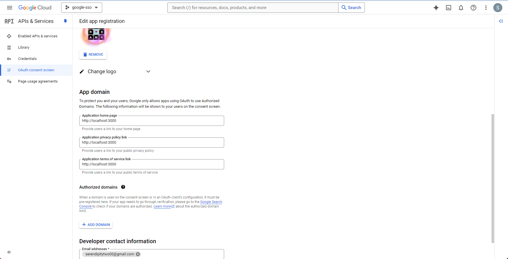
            </a>
            
    - Step 2: Scopes
        - Step 0
            
            <a href="./images/GCPImage5.png" style="margin-bottom: 20px; display: inline-block; border: 1px solid #ccc; padding: 10px; border-radius: 5px;">
                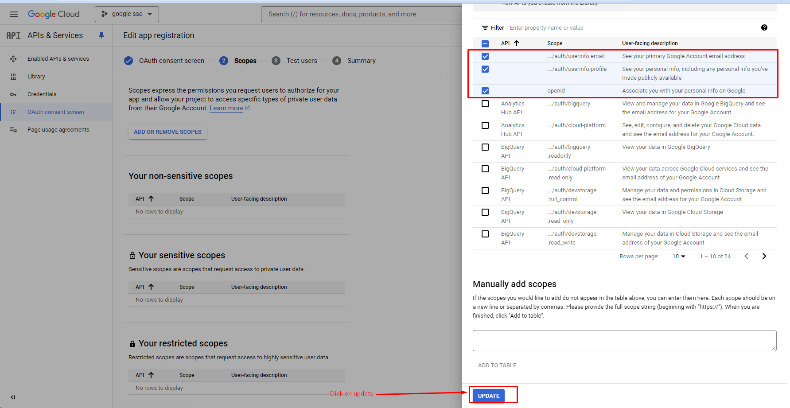
            </a>
            
        - Step 1
            
            <a href="./images/GCPImage6.png" style="margin-bottom: 20px; display: inline-block; border: 1px solid #ccc; padding: 10px; border-radius: 5px;">
                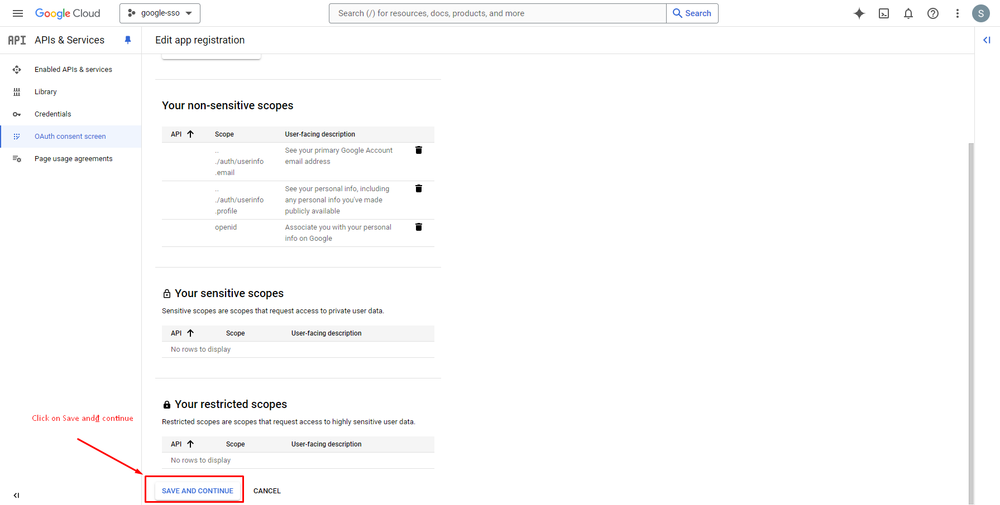
            </a>
            
    - Step 3: Test Users
        
        <a href="./images/GCPImage7.png" style="margin-bottom: 20px; display: inline-block; border: 1px solid #ccc; padding: 10px; border-radius: 5px;">
            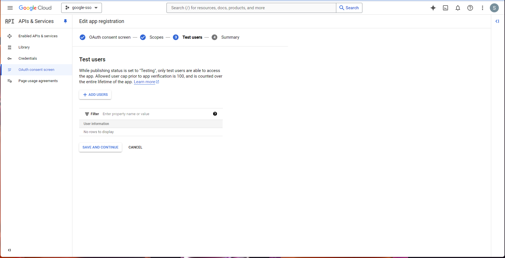
        </a>
        
        - Adding users for testing OAuth
            - Step 0
                
                <a href="./images/GCPImage8.png" style="margin-bottom: 20px; display: inline-block; border: 1px solid #ccc; padding: 10px; border-radius: 5px;">
                    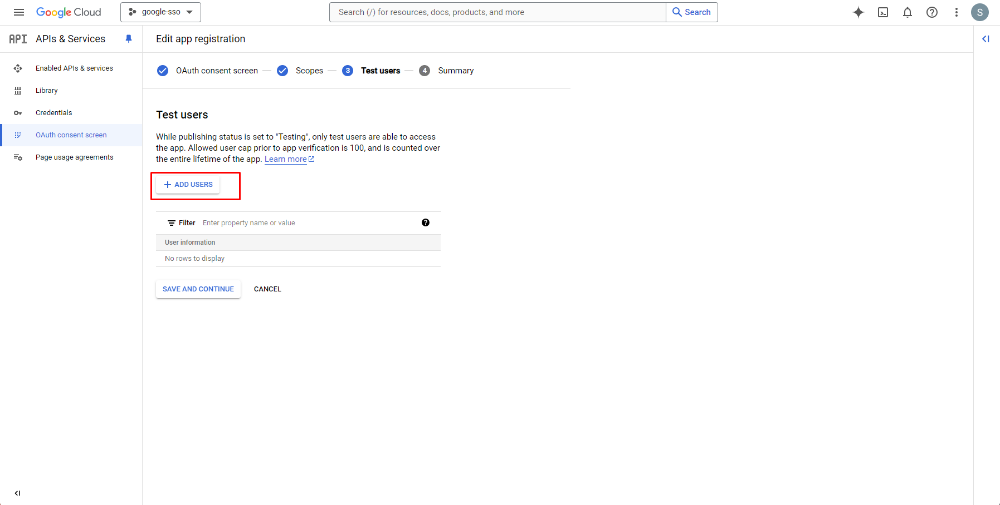
                </a>
                
            - Step 1
                
                <a href="./images/GCPImage9.png" style="margin-bottom: 20px; display: inline-block; border: 1px solid #ccc; padding: 10px; border-radius: 5px;">
                    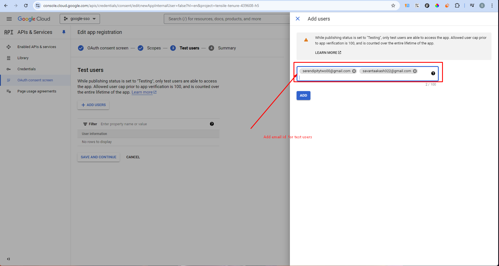
                </a>
                
            - Step 2: Added Users
                
                <a href="./images/GCPImage10.png" style="margin-bottom: 20px; display: inline-block; border: 1px solid #ccc; padding: 10px; border-radius: 5px;">
                    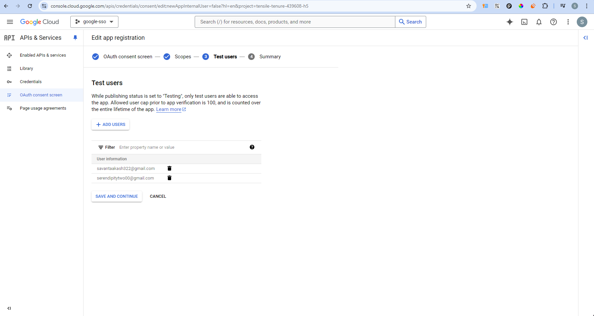
                </a>
                
            - Step 3: Save and Continue
                
                <a href="./images/GCPImage11.png" style="margin-bottom: 20px; display: inline-block; border: 1px solid #ccc; padding: 10px; border-radius: 5px;">
                    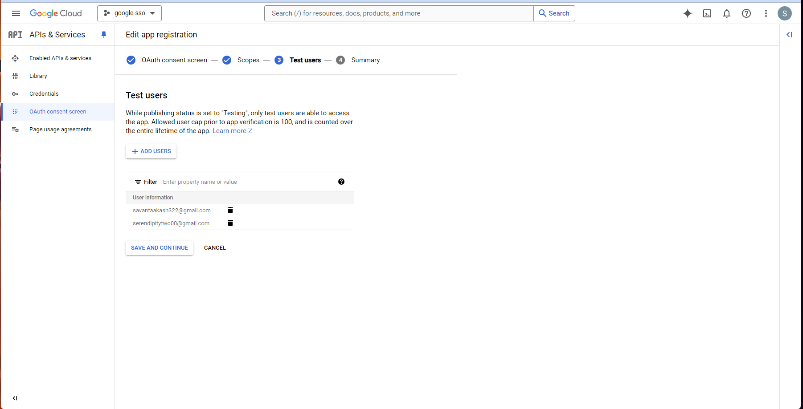
                </a>
                
                <a href="./images/GCPImage12.png" style="margin-bottom: 20px; display: inline-block; border: 1px solid #ccc; padding: 10px; border-radius: 5px;">
                    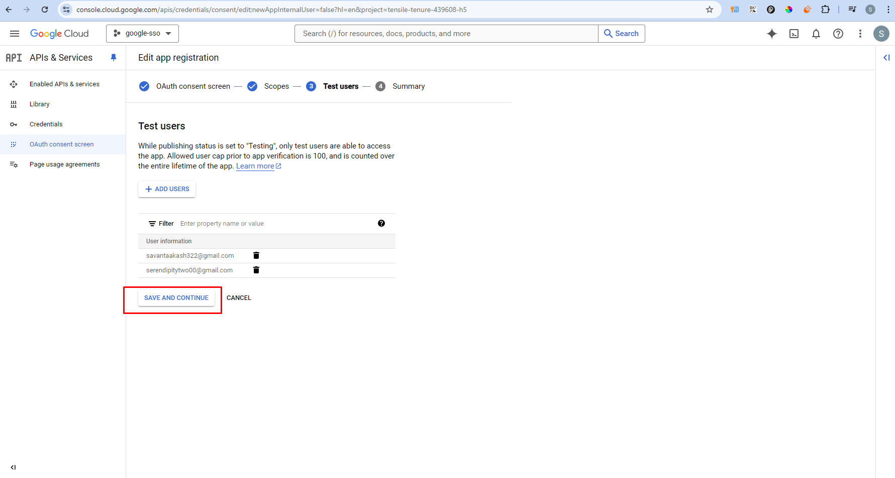
                </a>
                
            - Step 4: Summary
                
                <a href="./images/GCPImage13.png" style="margin-bottom: 20px; display: inline-block; border: 1px solid #ccc; padding: 10px; border-radius: 5px;">
                    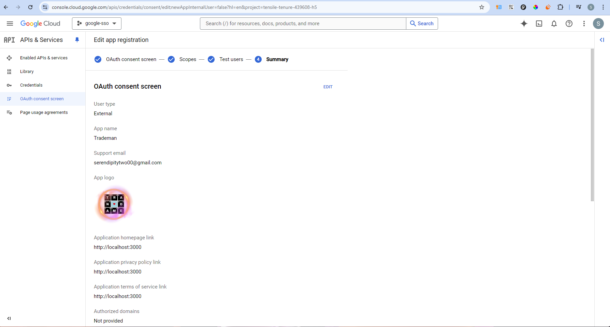
                </a>

## Step 2: Setting up Credentials

- Step 2: Setting up credentials
    - Step 0
        
        <a href="./images/GCPImage14.png" style="margin-bottom: 20px; display: inline-block; border: 1px solid #ccc; padding: 10px; border-radius: 5px;">
            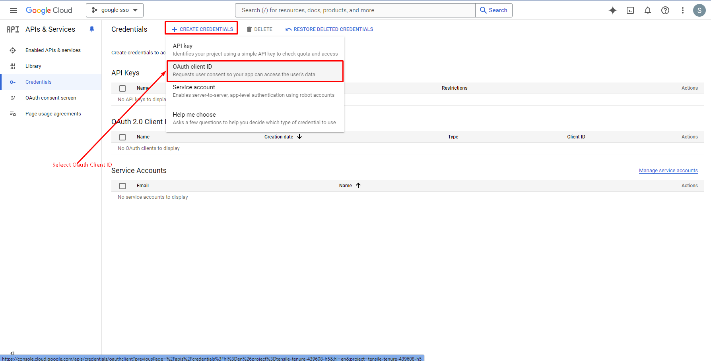
        </a>
        
    - Step 1: Selecting Application for Creating OAuth Client ID
        
        [http://localhost:3000/api/auth](http://localhost:3000/api/auth)/callback/google
        
    - Step 2: Click on Create for Setting Up Credentials
        
        <a href="./images/GCPImage15.png" style="margin-bottom: 20px; display: inline-block; border: 1px solid #ccc; padding: 10px; border-radius: 5px;">
            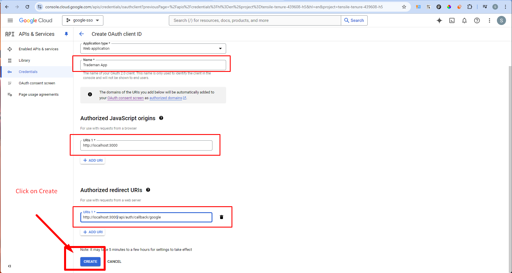
        </a>
        
    - Step 3: OAuth Client Created Confirmation Popup
        
        ```
        Client ID: YOUR_CLIENT_ID 
        Client Secret : YOUR_CLIENT_SECRET
        Creation date : YOUR_CREATION_DATE
        Status : Enabled 
        ```

## Step 3: Code Setup

- Libraries to install:
    - "@prisma/client": "^5.3.1",
    - "prisma": "^5.3.1"


##Auth.js Setup

Agenda :

- OAuth (Google,Github)

-Email,magic Links(via Resend)

-protecting pages ,server actions ,route handlers 

- Server side v/s client side authentication, caching
- Roles : admin

[https://github.com/codinginflow/next-auth-v5](https://github.com/codinginflow/next-auth-v5)