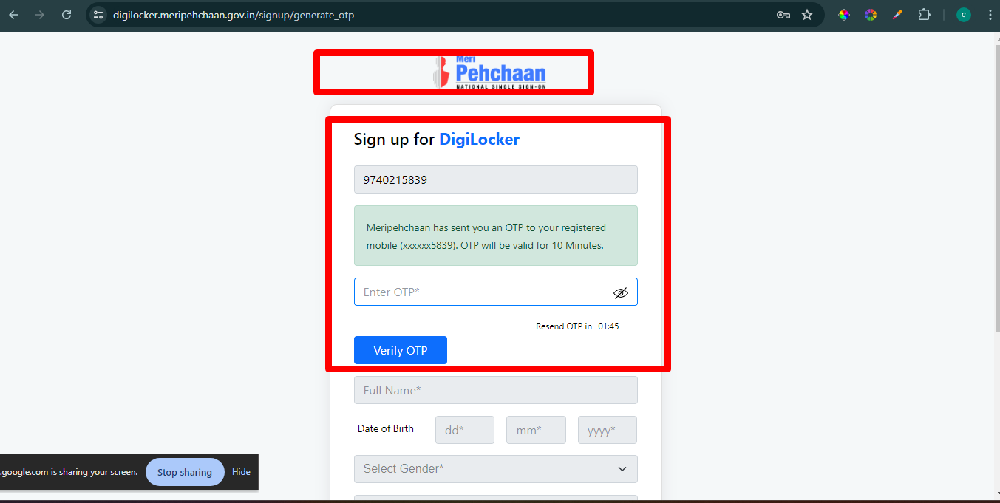
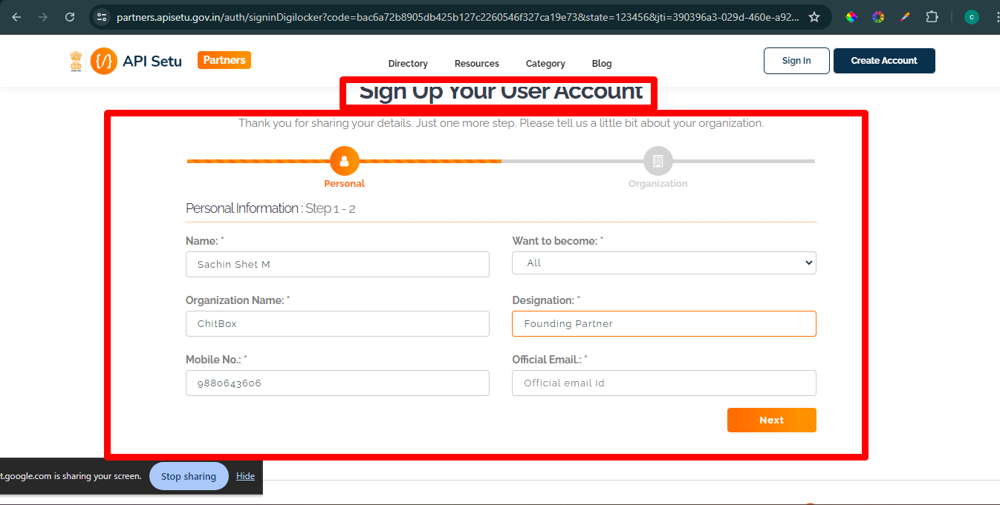
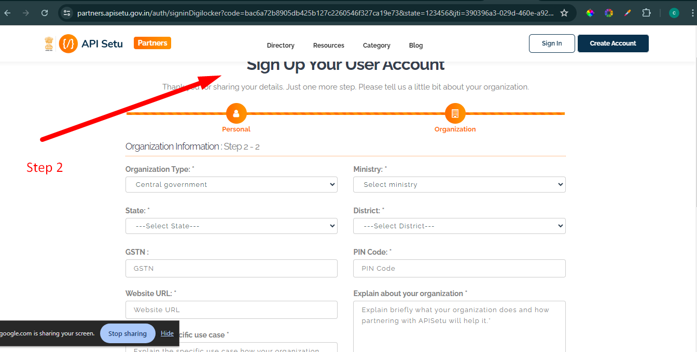
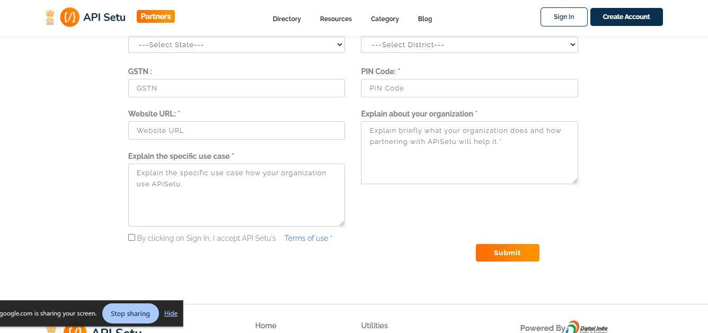
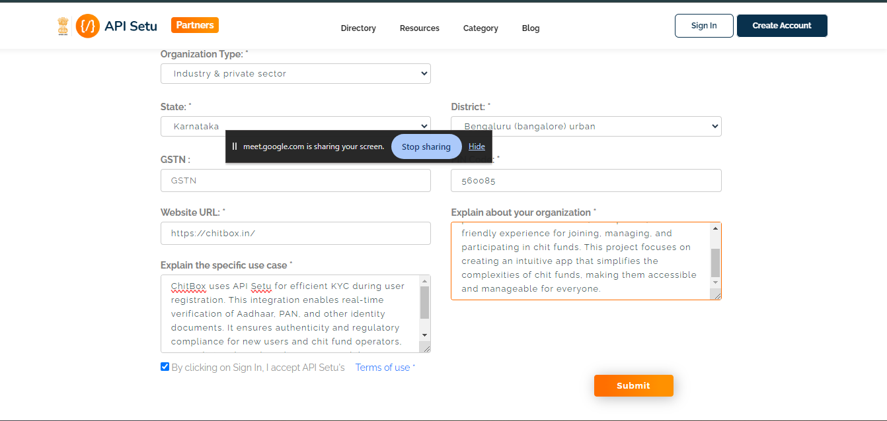
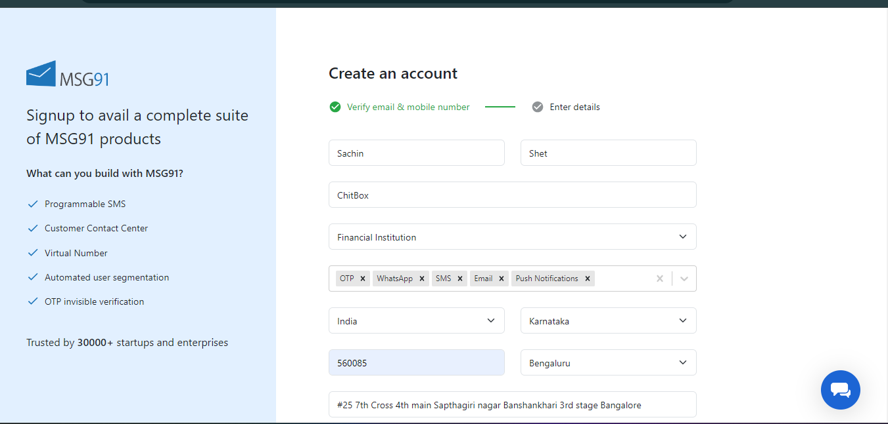
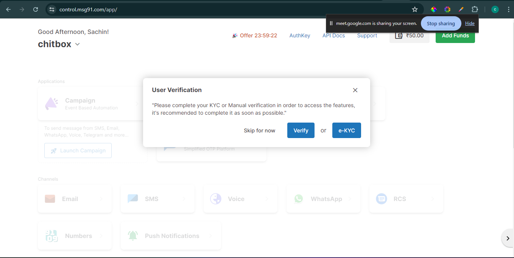

# APi Sethu documentation

- Website
    
    Step 1: go to website :
    https://digilocker.meripehchaan.gov.in/signup
    

    
- Step 2:
    

it will take 15 days to approve account

[Application for API sethu](../Images/Mail.pdf)

- MSG 91 Service
    

    
- ekyc
    
    Aadhar number , Mobile number linked to aadhar
    
    
    

[Sending sms from msg91 dashboard](https://msg91.com/help/how-to-send-sms-from-my-msg91-dashboard)

- Warning:  for OTP and sms Service
    
    DLT Process:
    As per the TRAI(Telecom Regulatory Authority of India) guidelines in India, every Indian Entity/Organization that wants to send SMS to Indian mobile numbers is required to complete DLT Registration mandatorily to get their Sender IDs and SMS content templates approved. 
    
    step-by-step process of DLT that needs to be done on any of the DLT portals available: 
    
    - Step 1: Register your Business Entity/Organization
        
        [**Entity Registration on DLT Platform**](../apisethudocs/DLTEntityRegistration.md)
        
    - **Step 2** - Once your entity is approved, log in on the DLT portal with the credential received by your DLT operator and register your Sender ID (Header). The process is almost the same on every DLT portal. Here is a sample of PingConnect
        
        
        [DLT Header Registration | Process Manual | PingConnect](../apisethudocs/DLTHeaderManualPing.md)
        
    - **Step 3** - And once Header is approved, please apply for the approval of your SMS contents
        
        [Get Approval for your SMS Content on DLT Platform](../apisethudocs/DLTContentApproval.md)
        
    
    Additionally, this will help with the steps to be followed on the MSG91 side once your DLT is done. Also, you can refer to the [FAQs on DLT.](https://help.msg91.com/article/349-dlt-faqs)
    
    [Step by Step Guide to implement DLT in SMS](../apisethudocs/DLTImplementationGuide.md)
    
    ## Note - If you find this process difficult, please opt for [Premium DLT Support](https://msg91.com/help/dlt-premium-support) and we will assign a DLT expert to you to get this done at priority.
    
    Reference: