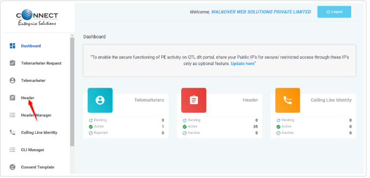
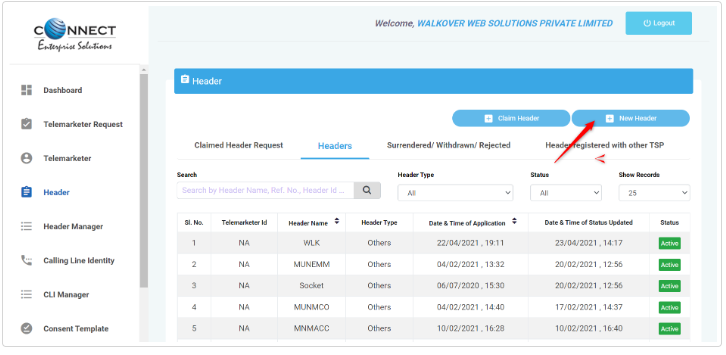
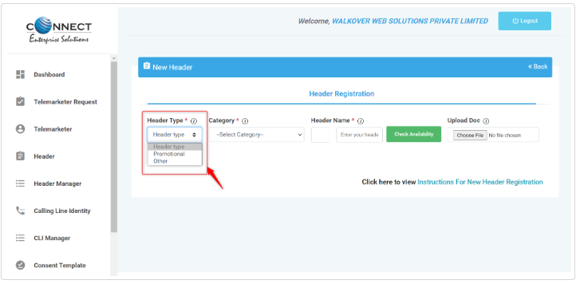
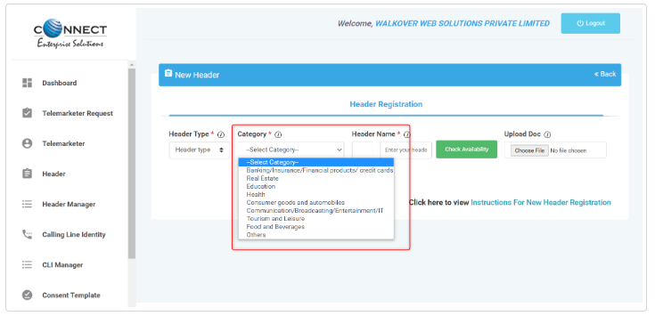
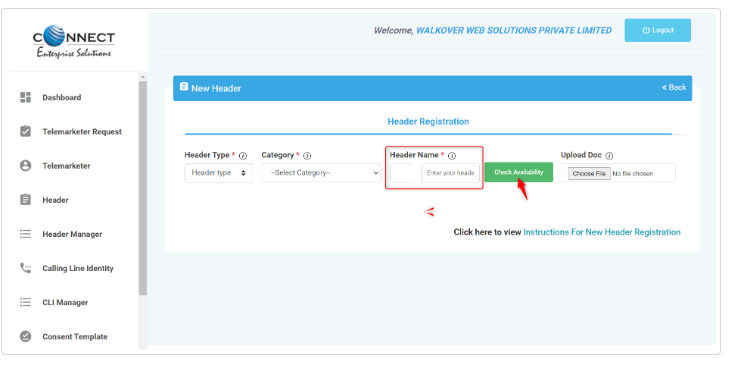

# DLT Header Registration | Process Manual | PingConnect

### Header Registration for PingConnect

**Step 1:**

Login into your account >> on the left panel >> click on the header

**Step 2:** Click on New Header

**Step 3:**

Click On header type and select header:

- **Other >>** If you are using our Transactional or SendOTP Routes.
- **Promotional >>** If you are using our Promotional Route.

**Step 4:** Click on **Category >> scroll** down to select your working category, e.g., Technology, Entertainment

**Step 5:**

Enter the Header that matches your Registered Company Name or Brand Name (Ex- Apple Inc. will use Sender as iApple) and click on 'check availability':

**Note: As of now, Operators are approving Headers other than 6 alphabets, but no Operator has the functionality to send SMS with Headers other than 6 alphabets.**

So, request you to **get any 6 alphabet Header** (in correlation with your organization name) approved from Operator and use only that for sending SMS.

1. If not available, try another.
2. If available and Sender Id matches the Company Name, then get the OTP, feed it and submit.
3. If available, but your Sender Id does not match your Company Name, then upload a document to prove the co-relation between Company Name and Header.(If Alphabet Inc. needs Sender ID as Google, they need to prove co-relation between Sender Id GOOGLE and Alphabet.) (If the Operator is not satisfied with co-relation proof, your Header may not be approved)
